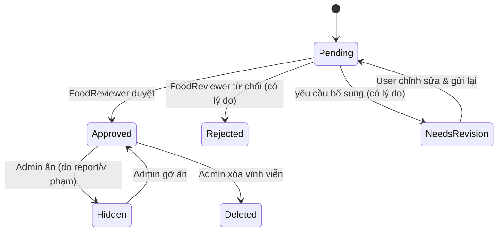
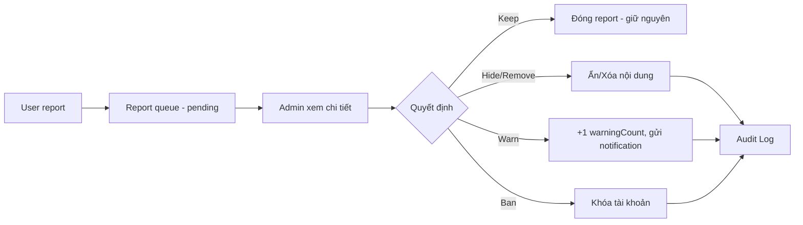
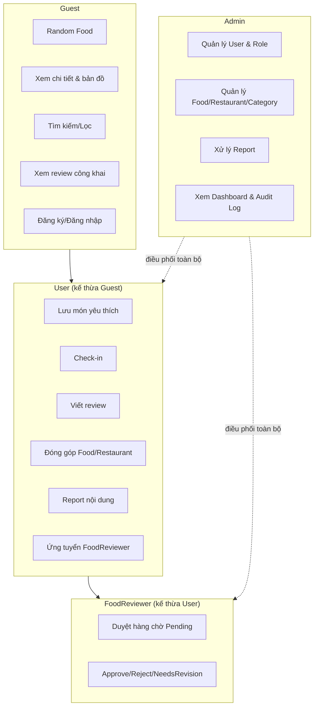
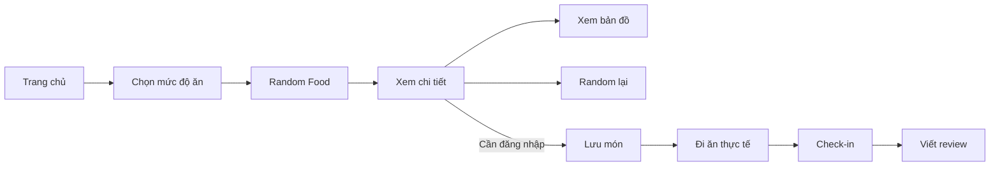

# NayAnGi — Business Rules & Use Cases (Print 1 — MVP)

> Tài liệu nghiệp vụ chính thức cho bản MVP. UI/UX (navbar, tên tab "Lịch sử"/"Cài đặt", cách sắp xếp màn hình...) chỉ mang tính tham khảo và có thể thay đổi linh hoạt theo từng đợt cập nhật — tài liệu này chỉ ràng buộc **nghiệp vụ (business logic)**, không ràng buộc UI.
>
> Core feature xuyên suốt MVP: **Random Food theo 4 mức độ ăn**, có kèm **bản đồ định vị quán** (Leaflet + OSM) để người dùng xem vị trí và di chuyển tới nơi ăn.

---

## 0. Phạm vi Print 1 (MVP)

**Có trong MVP:**
- Random Food theo 4 mức độ ăn
- Bản đồ định vị quán (xem vị trí, không chỉ đường phức tạp)
- Guest dùng random không cần đăng nhập
- User: lưu món, check-in, review, đóng góp Food/Restaurant
- FoodReviewer: kiểm duyệt nội dung đóng góp
- Admin: quản trị toàn hệ thống, xử lý report, audit log

**Không có trong MVP (đẩy sang Phase 2/3):** Restaurant Owner role, thanh toán, đặt bàn/đặt món, loyalty/XP phức tạp, AI recommendation, social feed, chat, geotag bắt buộc, đa ngôn ngữ, follow user, collection tùy chỉnh.

---

## 1. Role Matrix

| Role | Đăng nhập? | Mô tả |
|---|---|---|
| **Guest** | Không | Người dùng vãng lai — random, xem thông tin, xem bản đồ, xem review công khai. Không lưu trữ gì. |
| **User** | Có | Vai trò mặc định khi đăng ký. Cá nhân hóa, đóng góp nội dung, review, check-in. |
| **FoodReviewer** | Có | Do Admin chỉ định từ User. Kiểm duyệt Food/Restaurant do cộng đồng đóng góp. |
| **Admin** | Có | Toàn quyền quản trị hệ thống. |

**Nguyên tắc phân quyền:**
- **BR-01**: Mỗi tài khoản chỉ có một role tại một thời điểm.
- **BR-02**: Tài khoản đăng ký mới mặc định là `User`.
- **BR-03**: `User → FoodReviewer` chỉ qua Admin phê duyệt (User nộp đơn ứng tuyển, Admin duyệt).
- **BR-04**: Admin có quyền chỉ định hoặc thu hồi role FoodReviewer bất cứ lúc nào.
- **BR-05**: FoodReviewer bị thu hồi role sẽ trở lại `User`, dữ liệu cũ (lịch sử duyệt) được giữ nguyên cho audit.
- **BR-06**: Admin có toàn quyền quản trị và có thể thực hiện thao tác kiểm duyệt thay FoodReviewer khi cần (ví dụ hệ thống chỉ có 1 FoodReviewer và họ chính là người đóng góp món đó).

---

## 2. Random Food — Core Feature

### 2.1 Bốn mức độ ăn (không phải role, không thay thế Category)

| Mã | Mức độ | Ví dụ |
|---|---|---|
| `snack` | Ăn vặt | Bánh tráng trộn, chè, trà sữa, ốc luộc |
| `normal` | Ăn bình thường | Cơm tấm, phở bò, bún chả, bánh mì |
| `hearty` | Ăn vừa vừa | Bún đậu mắm tôm, cơm gà xối mỡ, mì cay |
| `full` | Ăn lớn | Lẩu, buffet nướng, sushi, hải sản |

Ghi chú (kcal) chỉ mang tính ước lượng UX, **không phải dữ liệu dinh dưỡng chính xác**.

### 2.2 Business Rules — Random

- **BR-R01**: Mỗi Food phải được gắn ít nhất 1 `eatingLevel`.
- **BR-R02**: Một Food có thể thuộc nhiều `eatingLevels` nếu phù hợp (vd: Lẩu → `hearty` + `full`).
- **BR-R03**: Random chỉ chọn trong tập Food có `moderationStatus = approved` **và** `visibility = visible`, phù hợp mức độ đã chọn.
- **BR-R04**: Food ở trạng thái `pending`, `rejected`, `needs_revision`, `hidden`, `deleted` không được xuất hiện trong random công khai.
- **BR-R05**: Random không đảm bảo "ngon nhất"/"phổ biến nhất" — chỉ là lựa chọn ngẫu nhiên trong tập phù hợp.
- **BR-R06**: Nếu không đủ món phù hợp bộ lọc đã chọn → hiển thị thông báo phù hợp (vd: "Hiện chưa có nhiều món phù hợp") kèm lựa chọn: random lại / mở rộng khu vực / xem tất cả.
- **BR-R07**: Trong cùng phiên random (session), hạn chế trả lại món vừa xuất hiện. Với Guest, xử lý hoàn toàn phía client (không cần lưu server).
- **BR-R08**: Random phải ưu tiên các điều kiện lọc thêm mà người dùng chọn (khu vực, khoảng giá) nếu có.
- **BR-R09**: Rating hiển thị để tham khảo, không dùng để biến Random thành bảng xếp hạng.
- **BR-R10**: Mỗi kết quả random cho phép: xem chi tiết, xem vị trí trên bản đồ, lưu món (nếu đã đăng nhập), random lại.

---

## 3. Use Cases theo Role

### 3.1 Guest

| ID | Use Case |
|---|---|
| UC-G01 | Xem trang chủ |
| UC-G02 | Chọn 1 trong 4 mức độ ăn |
| UC-G03 | Random món ăn theo mức độ đã chọn |
| UC-G04 | Random lại (tránh lặp trong phiên) |
| UC-G05 | Xem chi tiết món ăn (tên, ảnh, mô tả, giá, quán, review) |
| UC-G06 | Xem thông tin quán |
| UC-G07 | Xem vị trí quán trên bản đồ |
| UC-G08 | Tìm kiếm món ăn/quán |
| UC-G09 | Lọc món ăn (category, khu vực, khoảng giá) |
| UC-G10 | Xem review công khai |
| UC-G11 | Đăng ký tài khoản |
| UC-G12 | Đăng nhập |

*(Map: mọi UC-Gxx liên kết BR-R01→R10, BR-U01/U02 — Guest không lưu trữ.)*

### 3.2 User (kế thừa toàn bộ Guest)

| ID | Use Case | BR liên quan |
|---|---|---|
| UC-U01 | Đăng ký | BR-S01, BR-S02 |
| UC-U02 | Đăng nhập | BR-A02, BR-U13 |
| UC-U03 | Đăng xuất | — |
| UC-U04 | Cập nhật hồ sơ (tên, avatar, sở thích) | BR-U02 |
| UC-U05 | Lưu món yêu thích | BR-U02 |
| UC-U06 | Bỏ lưu món yêu thích | — |
| UC-U07 | Xem danh sách món yêu thích | — |
| UC-U08 | Check-in / đánh dấu đã ăn tại quán | BR-E01→E04 |
| UC-U09 | Xem lịch sử trải nghiệm (đã ăn) | — |
| UC-U10 | Đóng góp Food + Restaurant mới | BR-C01→C06, BR-U08 |
| UC-U11 | Xem trạng thái nội dung đã đóng góp | BR-U09 |
| UC-U12 | Chỉnh sửa nội dung bị `needs_revision`/`rejected` | BR-U10 |
| UC-U13 | Viết review (rating + comment) | BR-RV01→RV05, BR-U03, BR-U04 |
| UC-U14 | Sửa review của chính mình | BR-U05 |
| UC-U15 | Xóa review của chính mình | BR-U05, BR-U06 |
| UC-U16 | Report Food/Restaurant | BR-M01→M04 |
| UC-U17 | Report Review | BR-M01→M04 |
| UC-U18 | Đề xuất Category mới | BR-CA01, BR-CA02 |
| UC-U19 | Nộp đơn ứng tuyển FoodReviewer | BR-03 |
| UC-U20 | Xem trạng thái đơn ứng tuyển | — |
| UC-U21 | Nhận notification | — |
| UC-U22 | Chia sẻ món ăn (share link) | — |
| UC-U23 | Gửi góp ý/báo lỗi hệ thống | — |

**Business Rules — User:**
- **BR-U01**: Guest không lưu favorite/history lâu dài.
- **BR-U02**: Chức năng cần dữ liệu cá nhân bắt buộc đăng nhập.
- **BR-U03**: User chỉ review sau khi có Experience (check-in) hợp lệ tại đúng Restaurant/Food.
- **BR-U04**: Mỗi User chỉ có 1 review chính thức cho 1 cặp (Food, Restaurant).
- **BR-U05**: User chỉ sửa/xóa review do chính mình tạo.
- **BR-U06**: User không được thay đổi/xóa review người khác.
- **BR-U07**: Review bị report không tự động xóa — phải qua moderation.
- **BR-U08**: Food/Restaurant do User đóng góp ban đầu ở trạng thái `pending`.
- **BR-U09**: User không được tự chuyển nội dung của mình thành `approved`.
- **BR-U10**: User chỉ chỉnh sửa nội dung của chính mình.
- **BR-U11 / BR-U12**: User không tạo Category chính thức, chỉ được đề xuất (proposal) cho Admin.
- **BR-U13**: Tài khoản bị khóa (`accountStatus = banned`) không đăng nhập được, không thực hiện được chức năng cần tài khoản hoạt động.
- **BR-U14**: Rate limit áp dụng cho: submit Food, review, report (chống spam).

### 3.3 FoodReviewer (kế thừa toàn bộ User)

| ID | Use Case | BR liên quan |
|---|---|---|
| UC-F01 | Xem hàng chờ kiểm duyệt (Pending queue) | BR-F01 |
| UC-F02 | Xem chi tiết nội dung cần duyệt | — |
| UC-F03 | Approve Food/Restaurant (kèm ghi chú thẩm định) | BR-F04, BR-F05 |
| UC-F04 | Reject (kèm lý do) | BR-F06 |
| UC-F05 | Yêu cầu chỉnh sửa — `needs_revision` (kèm lý do) | BR-F07 |
| UC-F06 | Xem lịch sử duyệt của bản thân | BR-F09 |
| UC-F07 | Gắn cờ nội dung đáng ngờ, chuyển Admin xử lý | BR-F08 |
| UC-F08 | Yêu cầu Admin hỗ trợ (trường hợp không đủ Reviewer khác) | BR-06 |
| UC-F09 | Xin rút khỏi vai trò FoodReviewer | BR-05 |

**Business Rules — FoodReviewer:**
- **BR-F01**: Chỉ được duyệt nội dung đang `pending`.
- **BR-F02**: Không được tự duyệt Food/Restaurant do chính mình đóng góp.
- **BR-F03**: Nếu FoodReviewer là người đóng góp → phải do Reviewer khác hoặc Admin duyệt. Nếu hệ thống chỉ có 1 FoodReviewer tại thời điểm đó và họ là người đóng góp → tự động chuyển cho **Admin** xử lý (không được tự duyệt, không bị kẹt quy trình).
- **BR-F04**: Approve phải kèm: người duyệt, ngày xác minh, ghi chú thẩm định (ảnh minh chứng nếu có).
- **BR-F05**: FoodReviewer chỉ xác minh **tính tồn tại/đúng thông tin** của món & địa điểm, không xác nhận "ngon/dở".
- **BR-F06**: Reject bắt buộc có lý do.
- **BR-F07**: `needs_revision` bắt buộc có lý do/yêu cầu bổ sung rõ ràng.
- **BR-F08**: Không được sửa nội dung của User theo cách thay đổi ý nghĩa đóng góp mà không qua quy trình phù hợp (chỉ được yêu cầu sửa, không tự sửa hộ nội dung mô tả/tên món).
- **BR-F09**: Mọi thao tác Approve/Reject/NeedsRevision đều ghi Audit Log.

### 3.4 Admin (toàn quyền)

| ID | Use Case |
|---|---|
| UC-A01 | Xem danh sách User |
| UC-A02 | Xem chi tiết User |
| UC-A03 | Khóa tài khoản |
| UC-A04 | Mở khóa tài khoản |
| UC-A05 | Ẩn/xóa tài khoản theo chính sách |
| UC-A06 | Xử lý đơn ứng tuyển FoodReviewer |
| UC-A07 | Chỉ định FoodReviewer |
| UC-A08 | Thu hồi FoodReviewer |
| UC-A09 | Quản lý Food (sửa/ẩn/xóa bất kỳ) |
| UC-A10 | Quản lý Restaurant (sửa/ẩn/xóa bất kỳ) |
| UC-A11 | Quản lý Category (CRUD chính thức) |
| UC-A12 | Xử lý đề xuất Category |
| UC-A13 | Quản lý Review (ẩn/xóa vi phạm) |
| UC-A14 | Xử lý Report |
| UC-A15 | Xem Dashboard thống kê |
| UC-A16 | Xem Audit Log |

**Business Rules — Admin:**
- **BR-A01→A02**: Admin khóa/mở khóa tài khoản; tài khoản khóa không đăng nhập được.
- **BR-A03**: Khóa tài khoản không đồng nghĩa xóa dữ liệu ngay (soft-ban).
- **BR-A04→A05**: Admin toàn quyền quản lý Food/Restaurant, có quyền ẩn/xóa nội dung vi phạm.
- **BR-A06**: Admin là role duy nhất CRUD Category chính thức.
- **BR-A07→A08**: Admin approve/reject đơn ứng tuyển FoodReviewer, có quyền thu hồi role bất cứ lúc nào.
- **BR-A09**: Admin xử lý toàn bộ Report.
- **BR-A10**: Mọi thao tác quản trị quan trọng ghi Audit Log.

---

## 4. Food & Restaurant — Content Rules

- **BR-C01**: Food và Restaurant là 2 entity riêng biệt; 1 Restaurant có nhiều Food.
- **BR-C02**: Food phải thuộc 1 Restaurant hợp lệ.
- **BR-C03**: Restaurant tối thiểu cần: tên, địa chỉ, vị trí (tọa độ để hiển thị bản đồ).
- **BR-C04**: Food tối thiểu cần: tên, hình ảnh, mô tả, giá tham khảo, category, mức độ ăn phù hợp.
- **BR-C05**: Hạn chế tạo dữ liệu trùng lặp rõ ràng nếu hệ thống phát hiện được (trùng tên + gần vị trí).
- **BR-C06**: Food/Restaurant do User tạo phải ở `pending` trước khi công khai.
- **BR-C07** *(mới, giải quyết flow tạo mới)*: Khi User đóng góp Food tại Restaurant chưa tồn tại trong hệ thống, hệ thống tự tạo Restaurant kèm `status = pending` song song với Food. FoodReviewer thẩm định thực tế và duyệt **cả hai cùng lúc**. Nếu Restaurant đã `approved` sẵn từ trước, User chỉ cần đóng góp Food mới, không cần duyệt lại Restaurant.

### Trạng thái Food/Restaurant (2 tầng độc lập)
- `moderationStatus`: `pending → approved / rejected / needs_revision` (do FoodReviewer xử lý, `needs_revision → pending` sau khi User sửa).
- `visibility`: `visible → hidden / deleted` (do Admin xử lý sau khi có report/vi phạm, độc lập với moderationStatus).
- Chỉ hiển thị công khai/random khi `moderationStatus = approved` **và** `visibility = visible`.

---

## 5. Review & Experience (Check-in)

- **BR-E01**: Experience (check-in) thuộc về 1 User cụ thể.
- **BR-E02**: Experience phải liên kết với 1 Restaurant (và có thể gắn Food cụ thể nếu có).
- **BR-E03**: Review phải tham chiếu tới 1 Experience hợp lệ.
- **BR-E04**: Hạn chế tạo Experience giả để spam review — MVP giới hạn: **1 check-in / Restaurant / 24 giờ / User**, cộng thêm rate-limit chung. Geotag xác thực vị trí để Phase 2/3.

- **BR-RV01**: User phải có Experience hợp lệ trước khi review.
- **BR-RV02**: Mỗi User chỉ có 1 review chính thức cho 1 (Food, Restaurant).
- **BR-RV03**: Review gắn với: User, Food, Restaurant, Experience.
- **BR-RV04**: Review gồm rating + comment (MVP không có ảnh review).
- **BR-RV05**: Rating không phải bằng chứng xác minh món ăn (khác với FoodReviewer verification).
- **BR-RV06**: Review bị report → vào moderation queue.
- **BR-RV07**: Admin có quyền Hide/Remove review vi phạm.
- **BR-RV08**: Không hard-delete review ngay khi có report — chỉ xử lý sau khi Admin xem xét.

---

## 6. Category

- **BR-CA01**: User không tạo Category chính thức.
- **BR-CA02**: Category chính thức chỉ do Admin CRUD.
- **BR-CA03**: Category proposal có trạng thái `pending / approved / rejected`, lưu riêng ở `categoryProposals` (không lẫn vào `categories`).

| ID | Use Case |
|---|---|
| UC-C01 | Xem Category |
| UC-C02 | Lọc Food theo Category |
| UC-C03 | User đề xuất Category |
| UC-C04 | Admin xem Category proposal |
| UC-C05 | Admin approve/reject proposal |
| UC-C06 | Admin CRUD Category |

---

## 7. Report & Moderation

- **BR-M01**: Report không đồng nghĩa nội dung vi phạm — chỉ là tín hiệu.
- **BR-M02**: Admin phải kiểm tra nội dung trước khi xử lý.
- **BR-M03**: Moderation action (Keep/Hide/Remove/Warn/Ban) phải có lý do.
- **BR-M04**: Mọi moderation action ghi Audit Log.
- **BR-M05** *(mới)*: User bị Warn nhiều lần cộng dồn (`warningCount` trên `users`) — MVP chưa tự động ban theo ngưỡng, Admin tự quyết định dựa trên số cảnh cáo.

| ID | Use Case |
|---|---|
| UC-M01 | User report Food/Restaurant |
| UC-M02 | User report Review |
| UC-M03 | Admin xem Report queue |
| UC-M04 | Admin xem chi tiết Report |
| UC-M05 | Admin xử lý Report (Keep/Hide/Remove/Warn/Ban) |

---

## 8. Notification (MVP)

| ID | Use Case |
|---|---|
| UC-N01 | Xem notification |
| UC-N02 | Đánh dấu đã đọc |
| UC-N03 | Đánh dấu tất cả đã đọc |

Loại notification MVP: `food_approved`, `food_rejected`, `food_needs_revision`, `report_handled`, `reviewer_application_result`, `system`.

---

## 9. Audit Log

| ID | Use Case |
|---|---|
| UC-L01 | Admin xem Audit Log |

Hành động bắt buộc log: approve/reject/needs_revision Food-Restaurant, ban/unban user, hide/delete Food-Review, approve/reject FoodReviewer application, assign/remove FoodReviewer role, category management.

---

## 10. Business Rules chung (toàn hệ thống)

- **BR-S01**: Email đăng ký phải unique.
- **BR-S02**: Tài khoản mới mặc định `User`.
- **BR-S03**: Mọi dữ liệu user-generated đều có owner (`createdBy`/`userId`).
- **BR-S04**: User chỉ sửa/xóa dữ liệu do mình tạo, trừ Admin.
- **BR-S05**: Dữ liệu đã ẩn/xóa không xuất hiện trong trải nghiệm public.
- **BR-S06**: Rate limit áp dụng cho hành vi dễ spam (submit, review, report, check-in).
- **BR-S07**: Admin action quan trọng phải có Audit Log.
- **BR-S08**: Không hard-delete dữ liệu cần truy vết nếu không bắt buộc (ưu tiên soft-delete qua `visibility`/`accountStatus`).

---

## 11. Use Case Diagram (mô tả)

---

## 12. Main User Flows

**Flow 1 — Guest:**
Trang chủ → Chọn mức độ ăn → Random → Xem kết quả → Xem chi tiết → Xem vị trí trên bản đồ → Random lại → (muốn lưu → yêu cầu đăng nhập)

**Flow 2 — User trải nghiệm đầy đủ:**
Đăng nhập → Chọn mức độ ăn → Random → Lưu món → Đi ăn → Check-in → Viết review

**Flow 3 — Contribution (đóng góp nội dung):**
User submit Food (+ Restaurant nếu mới) → `pending` → FoodReviewer thẩm định thực tế → Approve/Reject/NeedsRevision → (nếu Approved) → Public

**Flow 4 — Moderation:**
User report → Admin queue → Admin xem xét → Action (Keep/Hide/Remove/Warn/Ban) → Audit Log → Notification (nếu cần)

**Flow 5 — Trở thành FoodReviewer:**
User ứng tuyển → Admin xem đơn → Approve → Role đổi thành FoodReviewer → Vào hàng chờ duyệt → Verify thực tế → Approve/Reject/NeedsRevision

---

## 13. Permission Matrix

| Chức năng | Guest | User | FoodReviewer | Admin |
|---|:---:|:---:|:---:|:---:|
| Random Food | ✅ | ✅ | ✅ | ✅ |
| Xem chi tiết / bản đồ / review công khai | ✅ | ✅ | ✅ | ✅ |
| Lưu món yêu thích | ❌ | ✅ | ✅ | ✅ |
| Check-in | ❌ | ✅ | ✅ | ✅ |
| Viết/sửa/xóa review của mình | ❌ | ✅ | ✅ | ✅ |
| Đóng góp Food/Restaurant | ❌ | ✅ | ✅ | ✅ |
| Report nội dung | ❌ | ✅ | ✅ | ✅ |
| Đề xuất Category | ❌ | ✅ | ✅ | ✅ |
| Ứng tuyển FoodReviewer | ❌ | ✅ | — | — |
| Duyệt Food/Restaurant (Pending queue) | ❌ | ❌ | ✅ | ✅ |
| CRUD Category chính thức | ❌ | ❌ | ❌ | ✅ |
| Khóa/mở khóa tài khoản | ❌ | ❌ | ❌ | ✅ |
| Chỉ định/thu hồi FoodReviewer | ❌ | ❌ | ❌ | ✅ |
| Xử lý Report | ❌ | ❌ | ❌ | ✅ |
| Xem Audit Log / Dashboard | ❌ | ❌ | ❌ | ✅ |

---

## 14. Phase 2/3 (không làm ở MVP)

Restaurant Owner role, thanh toán, đặt bàn/đặt món, loyalty/XP phức tạp, AI recommendation, social feed, chat, live location tracking, geotag verification bắt buộc, đa ngôn ngữ, advanced analytics cho restaurant, collection tùy chỉnh, follow user/followers.