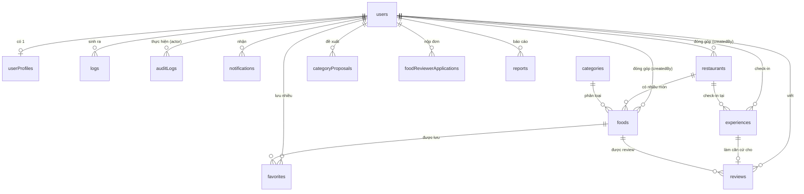

# NayAnGi — Thiết kế Database MongoDB (đồng bộ theo code thực tế)

> Cập nhật theo đúng schema Mongoose hiện có trong `src/lib/models/`. Backend: Next.js API Routes + MongoDB Atlas. Ảnh: Cloudinary. Bản đồ: Leaflet + OpenStreetMap/Nominatim. Đăng nhập: NextAuth.js (Credentials + Google) qua `@auth/mongodb-adapter`.
>
> So với bản thiết kế nghiệp vụ ban đầu (`business-rules-usecases.md`): các field/bảng cốt lõi giữ nguyên đúng như đã chốt. Tài liệu này bổ sung các field/bảng đã phát sinh trong quá trình code (auth, notification, tin tức) để phản ánh đúng **DB đang chạy**, không phải bản thiết kế lý thuyết. Nếu thấy sai lệch với code trong tương lai, cập nhật lại file này thay vì suy diễn từ tài liệu cũ.

## Sơ đồ quan hệ



*(`articles` — tin tức — là bảng độc lập, chưa có quan hệ với `users`, xem mục 14.)*

---

## 1. `users` (`src/lib/models/User.ts`)

```js
{
  _id: ObjectId,
  email: "trong@example.com",       // unique, required, lowercase
  passwordHash: "...",              // optional — null nếu đăng nhập bằng Google
  name: "Ttong",                    // required
  avatarUrl: "https://res.cloudinary.com/.../avatar.jpg",
  phone: "0901234567",
  role: "user",                     // "user" | "foodreviewer" | "admin"
  authProvider: "local",            // "local" | "google"
  googleId: null,
  accountStatus: "active",          // "active" | "banned"
  warningCount: 0,                  // số lần bị Admin cảnh cáo (BR-M05)
  isVerified: false,
  lastLoginAt: ISODate,
  createdAt: ISODate,
  // Không có field `updatedAt` trên User (khác bản thiết kế cũ).
  sessionVersion: 0,                // tăng lên để thu hồi mọi session đang hoạt động
                                     // (đổi mật khẩu, khoá tài khoản, "đăng xuất khỏi mọi thiết bị")
  lastActiveAt: ISODate             // mốc hoạt động gần nhất, dùng cho idle-timeout 30 phút
                                     // khi user không tick "ghi nhớ đăng nhập" (xem lib/auth.ts)
}
```

**Index:** `{ email: 1 }` unique (khai báo qua `unique: true` trong schema)

*(Guest không có bản ghi — không lưu trữ theo BR-U01.)*

> `sessionVersion`/`lastActiveAt` không nằm trong thiết kế nghiệp vụ ban đầu — được thêm để phục vụ cơ chế thu hồi phiên đăng nhập (session revocation) và tự động hết hạn phiên không hoạt động, xử lý trong `callbacks.session()` của NextAuth (`src/lib/auth.ts`), chạy lại mỗi request chứ không chỉ ở client.

---

## 2. `userProfiles` (`src/lib/models/UserProfile.ts`)

```js
{
  _id: ObjectId,
  userId: ObjectId,                 // ref users, required, unique
  displayName: "Ttong",
  avatarUrl: "https://res.cloudinary.com/.../avatar.jpg",
  preferences: {
    favoriteCategoryIds: [ObjectId],  // ref categories
    priceRange: { min: 15000, max: 100000 }
  },
  notificationPrefs: {              // bật/tắt từng loại notification, mặc định phần lớn = true
    food_approved: true,
    food_rejected: true,
    food_needs_revision: true,
    report_handled: true,
    reviewer_application_result: true,
    system: true,
    login_success: false,           // mặc định TẮT — tránh spam mỗi lần đăng nhập
    login_failed: true,
    account_banned: true,
    account_unbanned: true,
    password_changed: true
  },
  createdAt: ISODate,
  updatedAt: ISODate
}
```

**Index:** `{ userId: 1 }` unique

---

## 3. `restaurants` (`src/lib/models/Restaurant.ts`)

```js
{
  _id: ObjectId,
  name: "Quán Bún Bò Cô Ba",
  address: "123 Nguyễn Văn Cừ, Ninh Kiều, Cần Thơ",
  location: {                       // GeoJSON, bắt buộc [lng, lat]
    type: "Point",
    coordinates: [105.7469, 10.0333]
  },
  openingHours: "06:00 - 21:00",
  moderationStatus: "pending",      // "pending" | "approved" | "rejected" | "needs_revision"
  visibility: "visible",            // "visible" | "hidden" | "deleted"
  moderationNote: null,
  verification: {
    verifiedBy: ObjectId,           // ref users
    verifiedAt: ISODate,
    note: "Đã đến tận nơi, đúng địa chỉ, quán có thật"
  },
  createdBy: ObjectId,               // ref users, required
  createdAt: ISODate,
  updatedAt: ISODate
}
```

**Index:** `{ location: "2dsphere" }` · `{ moderationStatus: 1, visibility: 1 }`

---

## 4. `foods` (collection trung tâm — Random Food dựa vào đây) — `src/lib/models/Food.ts`

```js
{
  _id: ObjectId,
  restaurantId: ObjectId,           // ref restaurants — BẮT BUỘC (BR-C02)
  name: "Bún bò Huế đặc biệt",
  description: "Bún bò đậm vị, quán nhỏ ngay trung tâm",
  categoryIds: [ObjectId],          // ref categories, có thể nhiều category
  eatingLevels: ["normal", "hearty"], // BẮT BUỘC, ít nhất 1 phần tử (validate ở schema)
                                       // "snack" | "normal" | "hearty" | "full" (BR-R01)
  images: [
    "https://res.cloudinary.com/.../food1.jpg"
  ],
  priceRange: { min: 25000, max: 45000 },
  caloriesEstimate: { min: 450, max: 650 }, // optional, chỉ tham khảo UX
  tags: ["bún", "cay"],
  moderationStatus: "pending",      // "pending" | "approved" | "rejected" | "needs_revision"
  visibility: "visible",            // "visible" | "hidden" | "deleted" — độc lập với moderationStatus
  moderationNote: null,             // lý do reject/needs_revision
  verification: {
    verifiedBy: ObjectId,
    verifiedAt: ISODate,
    note: "..."
  },
  avgRating: 0,                      // denormalized từ reviews
  ratingCount: 0,
  createdBy: ObjectId,               // ref users, required
  createdAt: ISODate,
  updatedAt: ISODate
}
```

**Index:**
- `{ moderationStatus: 1, visibility: 1, eatingLevels: 1 }` — index chính cho query Random Food (BR-R03/R04) và cho `GET /api/foods` (trang `/mon-an`)
- `{ restaurantId: 1 }`
- `{ categoryIds: 1 }`
- `{ name: "text", description: "text", tags: "text" }`

> Food chỉ "public/random được" khi `moderationStatus = approved` **và** `visibility = visible`. `GET /api/foods` (dùng cho trang danh sách món ăn) lọc đúng 2 điều kiện này.

---

## 5. `categories` (`src/lib/models/Category.ts`)

```js
{
  _id: ObjectId,
  name: "Cơm",
  slug: "com",                      // unique, required, lowercase
  icon: "🍚",
  description: "Các món cơm",
  isActive: true,
  createdAt: ISODate
}
```

**Index:** `{ slug: 1 }` unique

## 5b. `categoryProposals` (`src/lib/models/CategoryProposal.ts`)

```js
{
  _id: ObjectId,
  name: "Đồ chay",
  proposedBy: ObjectId,             // ref users, required
  status: "pending",                // "pending" | "approved" | "rejected"
  reviewedBy: ObjectId,
  reviewedAt: ISODate,
  createdAt: ISODate
}
```

---

## 6. `favorites` (`src/lib/models/Favorite.ts`)

```js
{
  _id: ObjectId,
  userId: ObjectId,                 // ref users, required
  foodId: ObjectId,                 // ref foods, required
  createdAt: ISODate
}
```

**Index:** `{ userId: 1, foodId: 1 }` unique · `{ userId: 1, createdAt: -1 }`

---

## 7. `experiences` (`src/lib/models/Experience.ts`)

```js
{
  _id: ObjectId,
  userId: ObjectId,                 // ref users, required
  restaurantId: ObjectId,           // ref restaurants, required
  foodId: ObjectId,                 // ref foods, optional — có thể check-in quán mà chưa gắn món cụ thể
  createdAt: ISODate
}
```

**Index:** `{ userId: 1, restaurantId: 1, createdAt: -1 }`

> Rule BR-E04 (**1 check-in / Restaurant / 24h / User**) áp dụng ở tầng API/logic, không có unique index tương ứng trong schema (kiểm tra bản ghi gần nhất trước khi cho tạo mới).

---

## 8. `reviews` (`src/lib/models/Review.ts`)

```js
{
  _id: ObjectId,
  userId: ObjectId,                 // ref users, required
  foodId: ObjectId,                 // ref foods, required
  restaurantId: ObjectId,           // ref restaurants, required
  experienceId: ObjectId,           // ref experiences, required (BR-RV03)
  rating: 4.5,                      // Number, min 1, max 5
  comment: "Ngon, giá hợp lý",
  status: "visible",                // "visible" | "hidden" (Admin moderation)
  createdAt: ISODate,
  updatedAt: ISODate
}
```

**Index:** `{ userId: 1, foodId: 1, restaurantId: 1 }` unique (chặn trùng review — BR-RV02) · `{ foodId: 1, status: 1 }`

> Khi tạo/sửa/xóa review: cần tự cập nhật lại `avgRating`/`ratingCount` trên `foods` tương ứng ở tầng API (không có trigger tự động trong schema).

---

## 9. `foodReviewerApplications` (`src/lib/models/FoodReviewerApplication.ts`)

```js
{
  _id: ObjectId,
  userId: ObjectId,                 // ref users, required
  status: "pending",                // "pending" | "approved" | "rejected" | "withdrawn" (withdrawn = user tự rút đơn)
  // --- Hồ sơ ứng viên (form /ung-tuyen-reviewer) — optional ở schema vì đơn cũ không có, bắt buộc kiểm ở API ---
  fullName: "Nguyễn Văn A",
  motivation: "Muốn góp phần giữ thông tin món ăn khu vực Ninh Kiều chính xác",  // lý do ứng tuyển do ứng viên viết
  expertiseCategoryIds: [ObjectId], // ref categories, chọn 2–4
  activeAreas: ["Ninh Kiều"],       // khu vực có thể xác minh thực địa, tối đa 5, chữ tự do
  socialLinks: [{ platform: "tiktok", url: "https://..." }],   // platform: "tiktok" | "instagram", tuỳ chọn
  portfolioImages: ["https://res.cloudinary.com/.../a.jpg"],   // 2–6 ảnh (Cloudinary)
  scenarioAnswer: "...",            // bài trả lời tình huống xác minh, 150–400 từ
  agreedAt: ISODate,                // thời điểm đồng ý cam kết đạo đức (= lúc nộp)
  commitmentVersion: "2026-09-v1",  // phiên bản văn bản cam kết đã đồng ý
  // --- Phía Admin ---
  reviewNote: "Hồ sơ phù hợp",      // ghi chú duyệt/từ chối của Admin (TÊN CŨ: `reason` — xem migration bên dưới)
  reviewedBy: ObjectId,
  reviewedAt: ISODate,
  createdAt: ISODate,
  updatedAt: ISODate
}
```

**Index:** `{ userId: 1, status: 1 }` · `{ userId: 1 }` **unique một phần** (`partialFilterExpression: { status: "pending" }`, tên `userId_pending_unique`) — mỗi user chỉ có 1 đơn đang chờ duyệt.

**Quy tắc nộp đơn (logic ở `features/reviewer-application/applicationLogic.ts`):** chỉ role `user` (không phải `foodreviewer`/`admin`), tài khoản `active`; đang có đơn `pending` thì không nộp thêm; bị `rejected` phải chờ 30 ngày kể từ `reviewedAt`; `withdrawn` thì nộp lại ngay. Nháp form chỉ lưu ở trình duyệt (localStorage), không vào DB.

> **Migration:** field `reason` đã đổi tên thành `reviewNote` (vì `reason` từng là ghi chú Admin nhưng tài liệu cũ lại mô tả là lý do của ứng viên — nay lý do của ứng viên là `motivation`). Script `scripts/migrateReviewerApplicationReviewNote.mjs` (mặc định dry-run, thêm `--apply` để chạy thật). Code admin đọc `reviewNote ?? reason` nên vẫn đúng trước khi chạy migration.

---

## 10. `reports` (`src/lib/models/Report.ts`)

```js
{
  _id: ObjectId,
  reporterId: ObjectId,             // ref users, required
  targetType: "food",               // "food" | "review" | "restaurant"
  targetId: ObjectId,               // required
  reason: "Thông tin sai sự thật",  // required
  status: "pending",                // "pending" | "reviewed"
  action: null,                     // "keep" | "hide" | "remove" | "warn_user" | "ban_user"
  handledBy: ObjectId,
  handledAt: ISODate,
  createdAt: ISODate
}
```

**Index:** `{ status: 1, createdAt: -1 }` · `{ targetType: 1, targetId: 1 }`

---

## 11. `notifications` (`src/lib/models/Notification.ts`)

```js
{
  _id: ObjectId,
  userId: ObjectId,                 // ref users, required
  type: "food_approved",            // required — xem danh sách đầy đủ bên dưới
  message: "Món 'Bún bò Cô Ba' của bạn đã được duyệt!",
  relatedId: ObjectId,
  isRead: false,
  createdAt: ISODate
}
```

**`type` enum đầy đủ (mở rộng so với bản thiết kế nghiệp vụ ban đầu):**
- Nhóm nghiệp vụ gốc: `food_approved` · `food_rejected` · `food_needs_revision` · `report_handled` · `reviewer_application_result` · `system`
- Nhóm auth/tài khoản (thêm khi làm đăng nhập, xem `src/lib/notify.ts` + `src/lib/auth.ts`): `login_success` · `login_failed` · `account_banned` · `account_unbanned` · `password_changed`

**Index:** `{ userId: 1, isRead: 1, createdAt: -1 }`

---

## 12. `auditLogs` (`src/lib/models/AuditLog.ts`)

```js
{
  _id: ObjectId,
  actorId: ObjectId,                // ref users (FoodReviewer/Admin), required
  action: "approve_food",           // required — xem enum đầy đủ trong AuditLog.ts:
                                     // approve_food | reject_food | needs_revision | ban_user | unban_user |
                                     // hide_review | delete_food | assign_reviewer | remove_reviewer |
                                     // approve_reviewer_application | reject_reviewer_application |
                                     // category_create | category_update | category_delete | handle_report
  targetType: "food",               // "food" | "restaurant" | "review" | "user" | "category" | "report", required
  targetId: ObjectId,               // required
  reason: "Đã kiểm tra tại chỗ, thông tin đúng",
  metadata: {},                     // Mixed, default {}
  createdAt: ISODate
}
```

**Index:** `{ createdAt: -1 }` · `{ actorId: 1 }` · `{ targetType: 1, targetId: 1 }`

---

## 13. `logs` (telemetry nội bộ — không phải audit, không hiển thị cho User) — `src/lib/models/Log.ts`

```js
{
  _id: ObjectId,
  userId: ObjectId,                 // ref users, optional — null nếu Guest/anonymous
  action: "spin_random",            // required, string tự do — vd "login" | "spin_random" | "search" | "error"
  metadata: {},                     // Mixed, default {}
  ip: "1.2.3.4",
  userAgent: "Mozilla/5.0...",
  createdAt: ISODate
}
```

**Index:** `{ createdAt: 1 }` — **TTL index, tự xóa sau đúng 90 ngày** (`expireAfterSeconds: 60 * 60 * 24 * 90`) · `{ userId: 1, createdAt: -1 }`

---

## 14. `articles` (mới — tin tức, chưa có trong thiết kế nghiệp vụ ban đầu) — `src/lib/models/Article.ts`

```js
{
  _id: ObjectId,
  title: "5 quán ăn khuya Ninh Kiều sinh viên hay ghé",
  slug: "5-quan-an-khuya-ninh-kieu",  // unique, required, lowercase
  excerpt: "Tóm tắt ngắn hiển thị ở trang danh sách tin tức...",
  content: "Nội dung đầy đủ bài viết...",
  coverImage: "https://res.cloudinary.com/.../article1.jpg",
  publishedAt: ISODate,              // default: Date.now
  createdAt: ISODate
}
```

**Không có index ngoài `_id` và unique trên `slug`.** Không có field liên kết User (`createdBy`) — hiện chưa có luồng CMS cho Admin, nội dung được tạo trực tiếp trong DB. Phục vụ trang `/tin-tuc` qua `GET /api/articles` (chỉ trả về, không lọc theo trạng thái vì không có field trạng thái).

> Nếu sau này cần Admin quản lý tin tức qua UI (CRUD, trạng thái draft/published, gắn tác giả), đây là thay đổi cấu trúc — cần hỏi và xác nhận trước khi thêm field theo đúng mục 7.4 CLAUDE.md.

---

## 14b. `userAchievements` (`src/lib/models/UserAchievement.ts`)

```js
{
  _id: ObjectId,
  userId: ObjectId,                 // ref users, required
  achievementId: "first_approved",  // required — khớp AchievementId trong src/constants/contribution.ts
  unlockedAt: ISODate               // default: Date.now
}
```

**Index:** `{ userId: 1, achievementId: 1 }` unique

> Chỉ lưu thành tựu **đã mở khoá** (giữ vĩnh viễn, có ngày đạt). Điều kiện mở khoá nằm ở code (`contributionLogic.ts`), được đồng bộ idempotent bởi `syncAchievements()` (`src/lib/achievements.ts`) khi user mở `/dong-gop` và khi FoodReviewer duyệt món. **Cấp độ đóng góp không lưu DB** — luôn tính động từ số món `approved` của user.

---

## 15. Collection do NextAuth.js quản lý (không tự sửa)

`authOptions` (`src/lib/auth.ts`) dùng `MongoDBAdapter` (`@auth/mongodb-adapter`) nhưng `session: { strategy: "jwt" }`, nên thực tế:
- **`accounts`** — được tạo/dùng thật để liên kết tài khoản Google OAuth với `users`.
- **`sessions`** — do dùng chiến lược JWT (session nằm trong cookie, không lưu DB) nên **collection này không được adapter sử dụng** trong luồng hiện tại.
- **`verification_tokens`** — chưa dùng vì chưa có Email Provider (magic link).

Adapter tạo document `users` cho tài khoản Google bằng field riêng (`name`/`email`/`image`/`emailVerified`), không đi qua Mongoose schema `User` nên thiếu `role`/`isVerified`/`avatarUrl`/`createdAt`/`sessionVersion`. `events.createUser` trong `src/lib/auth.ts` bổ sung lại các field này ngay khi user Google được tạo lần đầu — **không tự sửa logic này** nếu không hiểu rõ luồng, vì sai sót ở đây có thể khiến user Google thiếu field bắt buộc.

---

## Ghi chú thiết kế quan trọng

1. **`eatingLevels` là field bắt buộc và quan trọng nhất trong `foods`** — core feature Random Food.
2. **`moderationStatus` và `visibility` tách biệt** trên cả `foods` và `restaurants`: tầng 1 là kiểm duyệt nội dung mới (FoodReviewer), tầng 2 là kiểm duyệt sau khi đã public (Admin, do report). Chỉ public khi cả hai đều ở trạng thái tốt.
3. **3 tầng dữ liệu hành vi/trải nghiệm/đánh giá tách rời rõ ràng**:
    - `logs` = hành vi duyệt web (xem, random, search) — nội bộ, có TTL 90 ngày.
    - `experiences` = bằng chứng đã ăn thật (check-in) — hiển thị cho User trong tab "Lịch sử".
    - `reviews` = đánh giá chính thức, bắt buộc tham chiếu `experiences`.
4. **GeoJSON location luôn `[longitude, latitude]`** — dễ nhầm với cách nói "vĩ độ, kinh độ" của người Việt.
5. **`categoryIds` là mảng** — 1 món có thể thuộc nhiều category.
6. **`users` không có field `updatedAt`** — chỉ có `createdAt` + các mốc thời gian riêng (`lastLoginAt`, `lastActiveAt`). Đừng giả định `updatedAt` tồn tại khi viết code liên quan tới `User`.
7. **`sessionVersion` / `lastActiveAt` (users)** là cơ chế thu hồi phiên đăng nhập + idle-timeout, phát sinh khi làm tính năng đăng nhập — không có trong thiết kế nghiệp vụ gốc nhưng đã là một phần chính thức của schema hiện tại.
8. **`notificationPrefs` (userProfiles)** cho phép user bật/tắt từng loại notification — phát sinh cùng lúc với hệ thống notification.
9. **`articles` là collection độc lập, mới, chưa nằm trong bản thiết kế nghiệp vụ gốc** — phục vụ mục Tin tức, hiện không có moderation/owner.
10. **Restaurant tạo kèm Food mới** (BR-C07): khi submit Food tại quán chưa có trong hệ thống, tạo đồng thời `restaurants` (status `pending`) — FoodReviewer duyệt cả hai cùng lúc. *(Lưu ý: luồng đóng góp Food/Restaurant từ User chưa được code — mục này vẫn là thiết kế dự kiến, chưa có API tương ứng.)*
