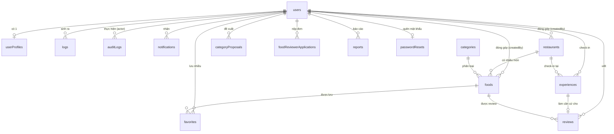

# NayAnGi — Thiết kế Database MongoDB (đồng bộ theo code thực tế)

> Cập nhật theo đúng schema Mongoose hiện có trong `src/lib/models/`. Backend: Next.js API Routes + MongoDB Atlas. Ảnh: Cloudinary. Bản đồ: Leaflet + OpenStreetMap/Nominatim. Đăng nhập: NextAuth.js (Credentials + Google) qua `@auth/mongodb-adapter`.
>
> So với bản thiết kế nghiệp vụ ban đầu (`business-rules-usecases.md`): các field/bảng cốt lõi giữ nguyên đúng như đã chốt. Tài liệu này bổ sung các field/bảng đã phát sinh trong quá trình code (auth, notification, tin tức) để phản ánh đúng **DB đang chạy**, không phải bản thiết kế lý thuyết. Nếu thấy sai lệch với code trong tương lai, cập nhật lại file này thay vì suy diễn từ tài liệu cũ.

## Sơ đồ quan hệ


```mermaid
erDiagram
    users ||--o| userProfiles : "có 1"
    users ||--o{ favorites : "lưu nhiều"
    users ||--o{ experiences : "check-in"
    users ||--o{ reviews : "viết"
    users ||--o{ logs : "sinh ra"
    users ||--o{ auditLogs : "thực hiện (actor)"
    users ||--o{ notifications : "nhận"
    users ||--o{ restaurants : "đóng góp (createdBy)"
    users ||--o{ foods : "đóng góp (createdBy)"
    users ||--o{ categoryProposals : "đề xuất"
    users ||--o{ foodReviewerApplications : "nộp đơn"
    users ||--o{ reports : "báo cáo"
    users ||--o| passwordResets : "quên mật khẩu"

    restaurants ||--o{ foods : "có nhiều món"
    categories ||--o{ foods : "phân loại"
    foods ||--o{ favorites : "được lưu"
    restaurants ||--o{ experiences : "check-in tại"
    experiences ||--o| reviews : "làm căn cứ cho"
    foods ||--o{ reviews : "được review"
```

*(`articles` — tin tức — là bảng độc lập, chưa có quan hệ với `users`, xem mục 14.)*

---

## 1. `users` (`src/lib/models/User.ts`)

```js
{
  _id: ObjectId,
  email: "trong@example.com",       // unique, required, lowercase
  passwordHash: "...",              // optional — không có nếu tài khoản chỉ đăng nhập bằng Google. Tài khoản Google
                                     // có thể thêm sau (docs/email-verification.md mục 6–7) → đăng nhập được cả 2 cách.
                                     // "Có mật khẩu hay không" LUÔN dựa vào field này, không dựa vào authProvider.
  name: "Ttong",                    // required
  avatarUrl: "https://res.cloudinary.com/.../avatar.jpg",
  phone: "0901234567",
  role: "user",                     // "user" | "foodreviewer" | "admin"
  authProvider: "local",            // "local" | "google" — cách TẠO tài khoản ban đầu (Google: events.createUser gán
                                     // "google" từ bản cập nhật này; user Google cũ backfill bằng `npm run migrate:google-auth-provider`).
  googleId: null,
  accountStatus: "active",          // "active" | "banned"
  warningCount: 0,                  // số lần bị Admin cảnh cáo (BR-M05)
  isVerified: false,                // đã xác thực email chưa (BR-S15). Mọi tài khoản mới (kể cả Google) = false,
                                     // bật qua OTP ở trang Hồ sơ hoặc khi thêm mật khẩu từ form Đăng ký
                                     // (collection emailVerifications). User Google tạo TRƯỚC bản cập nhật này vẫn
                                     // giữ true (không migrate — đã chốt). Chưa xác thực → không dùng được Quên mật khẩu.
  lastLoginAt: ISODate,
  createdAt: ISODate,
  // Không có field `updatedAt` trên User (khác bản thiết kế cũ).
  sessionVersion: 0,                // tăng lên để thu hồi mọi session đang hoạt động
                                     // (đổi mật khẩu, khoá tài khoản, "đăng xuất khỏi mọi thiết bị")
  lastActiveAt: ISODate,            // mốc hoạt động gần nhất, dùng cho idle-timeout 30 phút
                                     // khi user không tick "ghi nhớ đăng nhập" (xem lib/auth.ts)
  securityLock: {                   // OPTIONAL — chỉ có khi đang TẠM KHOÁ do sai OTP quên mật khẩu 5 lần
    lockedAt: ISODate,              // (khác accountStatus "banned" do Admin khoá). Không có field = không bị khoá.
    reason: "otp_failed",
    unlockTokenHash: "hex",         // HMAC-SHA256 của token trong link mở khoá — không lưu token thô
    unlockTokenExpiresAt: ISODate,  // 24h
    unlockEmailHistory: [ISODate],  // các lần gửi email mở khoá trong 1 giờ gần nhất (cooldown/giới hạn)
    lockIp: "1.2.3.4",
    lockUserAgent: "Mozilla/5.0..."
  }
}
```

**Index:** `{ email: 1 }` unique (khai báo qua `unique: true` trong schema) · `{ "securityLock.unlockTokenHash": 1 }` sparse

> `securityLock` thêm cho luồng Quên mật khẩu — chi tiết ở [`forgot-password.md`](forgot-password.md). Đang khoá: không đăng nhập được (Credentials + Google), không yêu cầu OTP được; phiên đang đăng nhập không bị đăng xuất.

*(Guest không có bản ghi — không lưu trữ theo BR-U01.)*

> `sessionVersion`/`lastActiveAt` không nằm trong thiết kế nghiệp vụ ban đầu — được thêm để phục vụ cơ chế thu hồi phiên đăng nhập (session revocation) và tự động hết hạn phiên không hoạt động, xử lý trong `callbacks.session()` của NextAuth (`src/lib/auth.ts`), chạy lại mỗi request chứ không chỉ ở client.

---

## 2. `userProfiles` (`src/lib/models/UserProfile.ts`)

```js
{
  _id: ObjectId,
  userId: ObjectId,                 // ref users, required, unique
  displayName: "Ttong",
  avatarUrl: "https://res.cloudinary.com/.../avatar.jpg",
  preferences: {
    favoriteCategoryIds: [ObjectId],  // ref categories
    priceRange: { min: 15000, max: 100000 }
  },
  notificationPreferences: {        // chỉ kênh EMAIL của các loại email tuỳ chọn (docs/notifications.md mục 2.4)
    email: { food_approved: true, food_rejected: true, food_needs_revision: true, content_removed: false }
  },                                // thông báo trong app luôn bật; email bắt buộc do server quyết định
  lastAnnouncementSeenAt: ISODate,  // mốc "Đánh dấu đã đọc hết" thông báo chính thức
  readAnnouncementIds: [ObjectId],  // ref announcements — bài đọc lẻ sau mốc trên; chưa đọc = publishAt > mốc
                                     // VÀ _id không nằm ở đây. "Đọc hết" → dọn sạch mảng (docs/notifications.md mục 6)
  createdAt: ISODate,
  updatedAt: ISODate
}
```

**Index:** `{ userId: 1 }` unique

---

## 3. `restaurants` (`src/lib/models/Restaurant.ts`)

```js
{
  _id: ObjectId,
  name: "Quán Bún Bò Cô Ba",
  address: "123 Nguyễn Văn Cừ, Ninh Kiều, Cần Thơ",   // BẮT BUỘC (BR-C03)
  location: {                       // KHÔNG bắt buộc — quán chưa ghim thì KHÔNG có field này
    type: "Point",                  // (subdocument default: undefined; không để { type:"Point" } thiếu coordinates)
    coordinates: [105.7469, 10.0333] // [lng, lat]
  },
  locationSource: "pin_confirmed",  // "gps" | "pin_confirmed" | "geocoded" | "none" — độ tin cậy vị trí
  images: ["https://res.cloudinary.com/.../nayangi/restaurants/a.jpg"], // 0–3 ảnh; [] nếu không có.
                                     // KHÔNG lưu URL ảnh mặc định — fallback khi hiển thị (RestaurantImage)
  nameNormalized: "quan bun bo co ba",          // không dấu, lowercase — tự cập nhật khi save (pre validate)
  addressNormalized: "123 nguyen van cu ninh kieu can tho",
  openingHours: "Hằng ngày 06:00–21:00",   // chuỗi TÓM TẮT do server sinh từ openingSchedule (giữ cho chỗ cũ đọc chuỗi)
  openingSchedule: {                // giờ mở cửa có cấu trúc — chi tiết: opening-hours.md
    status: "known",                //   "known" | "unknown" ("Không rõ giờ" — reviewer bổ sung)
    mode: "daily",                  //   "daily" | "weekly" (chế độ form)
    days: [{ day: 0, closed: false, allDay: false, ranges: [{ open: "06:00", close: "21:00" }] } /* …đủ 7 ngày */]
  },
  businessStatus: "open",          // "open" | "closed" — quán đóng cửa ẩn khỏi random, /mon-an, tìm kiếm,
                                     // chọn quán, quán gần; không xoá dữ liệu (BR-M12)
  closedAt: ISODate,                // khi businessStatus = "closed"
  mergedIntoRestaurantId: ObjectId, // quán trùng đã gộp vào quán gốc (visibility = "deleted") — mọi tham chiếu cũ
                                     // tự trỏ sang quán gốc (lib/restaurants.ts::resolveMergedRestaurantId)
  moderationStatus: "pending",      // "pending" | "approved" | "rejected" | "needs_revision" | "withdrawn"
                                     // withdrawn: quán mới đi kèm 1 đề xuất món bị user rút (không còn món nào khác dùng)
  visibility: "visible",            // "visible" | "hidden" | "deleted"
  moderationNote: null,
  verification: {
    verifiedBy: ObjectId,           // ref users
    verifiedAt: ISODate,
    note: "Đã đến tận nơi, đúng địa chỉ, quán có thật"
  },
  createdBy: ObjectId,               // ref users, required
  createdAt: ISODate,
  updatedAt: ISODate
}
```

**Index:** `{ location: "2dsphere" }` (bỏ qua quán không có `location`) · `{ moderationStatus: 1, visibility: 1 }` · `{ moderationStatus: 1, visibility: 1, _id: -1 }` (danh sách chọn quán "mới thêm gần đây", phân trang cursor)

**Atlas Search index `restaurants_search`** (tạo tay trên Atlas — xem [`contribute-food.md`](contribute-food.md) mục 6): fuzzy + autocomplete + bỏ dấu trên `name`/`address`. Chưa có index thì API tự fallback regex trên `nameNormalized`/`addressNormalized`.

---

## 4. `foods` (collection trung tâm — Random Food dựa vào đây) — `src/lib/models/Food.ts`

```js
{
  _id: ObjectId,
  restaurantId: ObjectId,           // ref restaurants — BẮT BUỘC (BR-C02)
  name: "Bún bò Huế đặc biệt",
  description: "Bún bò đậm vị, quán nhỏ ngay trung tâm",   // KHÔNG bắt buộc (BR-C04 cập nhật)
  categoryIds: [ObjectId],          // ref categories, 0–3 phần tử (tổng với đề xuất: 1–3). Có thể chứa
                                     // danh mục hệ thống "Khác" khi đề xuất chưa xử lý/bị từ chối (BR-CA06/CA08)
  proposedCategoryId: ObjectId,     // OPTIONAL, ref categoryProposals — danh mục user đề xuất kèm món (tối đa 1);
                                     // gỡ khi đề xuất được gộp/tạo mới/từ chối
  eatingLevels: ["normal", "hearty"], // BẮT BUỘC, ít nhất 1 phần tử (validate ở schema)
                                       // "snack" | "normal" | "hearty" | "full" (BR-R01)
  images: [
    "https://res.cloudinary.com/.../food1.jpg"
  ],
  priceRange: { min: 25000, max: 45000 },
  caloriesEstimate: { min: 450, max: 650 }, // optional, chỉ tham khảo UX
  tags: ["bún", "cay"],
  moderationStatus: "pending",      // "pending" | "in_review" | "needs_revision" | "approved" | "rejected" | "withdrawn"
                                     // — chỉ đổi qua lib/submissionWorkflow.ts (contribute-food.md mục 8)
  visibility: "visible",            // "visible" | "hidden" | "deleted" — độc lập với moderationStatus
  moderationNote: null,             // lý do reject/needs_revision — đây chính là "review_note" hiện cho user
  reviewerId: ObjectId,             // ref users — reviewer đang giữ (chỉ có khi in_review)
  claimedAt: ISODate,               // lúc nhận xác minh; quá CLAIM_TTL_HOURS (48h) thì tự nhả về pending
  editCount: 0,                     // số lần user tự sửa khi pending (tối đa MAX_PENDING_EDITS = 3, tính cả đổi quán), reset khi gửi lại
  verification: {
    verifiedBy: ObjectId,
    verifiedAt: ISODate,
    note: "..."
  },
  avgRating: 0,                      // denormalized từ reviews
  ratingCount: 0,
  createdBy: ObjectId,               // ref users, required
  createdAt: ISODate,
  updatedAt: ISODate
}
```

**Index:**
- `{ moderationStatus: 1, visibility: 1, eatingLevels: 1 }` — index chính cho query Random Food (BR-R03/R04) và cho `GET /api/foods` (trang `/mon-an`)
- `{ restaurantId: 1 }`
- `{ moderationStatus: 1, claimedAt: 1 }` — nhả đề xuất quá hạn · `{ reviewerId: 1, moderationStatus: 1 }` — tab "Đang giữ"
- `{ categoryIds: 1 }`
- `{ name: "text", description: "text", tags: "text" }`

> Food chỉ "public/random được" khi `moderationStatus = approved` **và** `visibility = visible`. `GET /api/foods` (dùng cho trang danh sách món ăn) lọc đúng 2 điều kiện này.

---

## 4b. `submissionnotes` (`src/lib/models/SubmissionNote.ts`) — mới 2026-10

Ghi chú đính chính user gửi reviewer khi đề xuất đang `in_review` (không sửa trực tiếp được).

```js
{
  _id: ObjectId,
  submissionId: ObjectId,   // ref foods — mỗi đề xuất là 1 món
  authorId: ObjectId,       // ref users — chủ đề xuất
  content: "Giá đúng là 35.000–45.000đ, mình gõ nhầm",  // 1–1000 ký tự
  createdAt: ISODate
}
```

**Index:** `{ submissionId: 1, createdAt: 1 }`. Rate limit 10 ghi chú/giờ/user (`rateLimits`).

> **Migration 2026-10:** `npm run migrate:submission-review` (dry-run) / `-- --apply` — gán `editCount: 0` cho món cũ, tạo index. Không đổi giá trị trạng thái nào.

---

## 5. `categories` (`src/lib/models/Category.ts`)

```js
{
  _id: ObjectId,
  name: "Cơm",
  slug: "com",                      // unique, required, lowercase
  icon: "🍚",
  description: "Các món cơm",
  isActive: true,
  group: "com",                     // nhóm cha: "mon-nuoc" | "com" | "banh" | "an-vat" | "do-uong" |
                                     // "trang-mieng" | "chay" | "khac" (src/constants/categoryGroups.ts)
  nameNormalized: "com",            // không dấu, lowercase — tự cập nhật khi save
  foodCount: 2,                     // số món approved + visible — denormalized, tính lại bởi
                                     // lib/categoryCounts.ts mỗi khi duyệt món / Admin ẩn-xoá / xử lý đề xuất
  createdAt: ISODate
}
```

**Index:** `{ slug: 1 }` unique

**Danh mục trong DB (2026-09):** Bánh, Bún, Cơm, Hủ tiếu, Chè / Tráng miệng (từ `seedFoods.mjs`) + **Chay** (nhóm Chay) + **Khác** (slug `khac`, danh mục hệ thống: user không tự chọn, Admin không tắt được, tự tạo nếu thiếu). `scripts/seedCategories.mjs` đã đồng bộ đúng danh sách này.

## 5b. `categoryProposals` (`src/lib/models/CategoryProposal.ts`)

```js
{
  _id: ObjectId,
  name: "Đồ nướng",                 // tên gốc lần đề xuất đầu tiên
  nameNormalized: "do nuong",       // khoá gộp đề xuất trùng tên
  proposedBy: ObjectId,             // ref users — người đề xuất ĐẦU TIÊN (giữ field cũ)
  proposerIds: [ObjectId],          // mọi người đã đề xuất tên này
  proposalCount: 3,                 // số lượt đề xuất (mỗi món gửi kèm = 1 lượt)
  foodIds: [ObjectId],              // món đã gửi kèm đề xuất này
  status: "pending",                // "pending" | "approved" | "merged" | "rejected"
  mergedIntoCategoryId: ObjectId,   // khi status = merged
  createdCategoryId: ObjectId,      // khi status = approved (chỉ Admin)
  reviewedBy: ObjectId,
  reviewedAt: ISODate,
  createdAt: ISODate
}
```

**Index:** `{ nameNormalized: 1 }` **unique một phần** (`status: "pending"`, tên `nameNormalized_pending_unique`) — gộp đề xuất bằng upsert an toàn khi nhiều người gửi cùng lúc · `{ status: 1, createdAt: -1 }`

> Luồng xử lý + phân quyền: [`contribute-food.md`](contribute-food.md) và BR-CA04→CA09 trong [`BR_UC.md`](BR_UC.md).

---

## 6. `favorites` (`src/lib/models/Favorite.ts`)

```js
{
  _id: ObjectId,
  userId: ObjectId,                 // ref users, required
  foodId: ObjectId,                 // ref foods, required
  createdAt: ISODate
}
```

**Index:** `{ userId: 1, foodId: 1 }` unique · `{ userId: 1, createdAt: -1 }`

---

## 7. `experiences` (`src/lib/models/Experience.ts`)

```js
{
  _id: ObjectId,
  userId: ObjectId,                 // ref users, required
  restaurantId: ObjectId,           // ref restaurants, required
  foodId: ObjectId,                 // ref foods, optional — có thể check-in quán mà chưa gắn món cụ thể
  createdAt: ISODate
}
```

**Index:** `{ userId: 1, restaurantId: 1, createdAt: -1 }`

> Rule BR-E04 (**1 check-in / Restaurant / 24h / User**) áp dụng ở tầng API/logic, không có unique index tương ứng trong schema (kiểm tra bản ghi gần nhất trước khi cho tạo mới).

---

## 8. `reviews` (`src/lib/models/Review.ts`)

```js
{
  _id: ObjectId,
  userId: ObjectId,                 // ref users, required
  foodId: ObjectId,                 // ref foods, required
  restaurantId: ObjectId,           // ref restaurants, required
  experienceId: ObjectId,           // ref experiences, required (BR-RV03)
  rating: 4.5,                      // Number, min 1, max 5
  comment: "Ngon, giá hợp lý",
  status: "visible",                // "visible" | "hidden" (Admin gỡ/ẩn) | "hidden_pending_review"
                                     // (tự ẩn tạm khi ≥ 3 user báo cáo — BR-M09). Chỉ "visible" hiện công khai
                                     // và được tính vào avgRating/ratingCount.
  createdAt: ISODate,               // mốc tính hạn sửa 24h (BR-RV09)
  updatedAt: ISODate,
  deletedAt: ISODate                // optional — xóa mềm khi User tự xóa review đã quá 24h (BR-RV11)
}
```

**Index:** `{ userId: 1, foodId: 1, restaurantId: 1 }` unique (chặn trùng review — BR-RV02) · `{ foodId: 1, status: 1 }`

**Thời hạn đánh giá (kiểm tra ở tầng API — `src/lib/reviews.ts`, hàm thuần ở `src/lib/reviewWindow.ts`, hằng số ở `src/constants/limits.ts`):**
- **Viết** (`POST /api/reviews`): chỉ khi `experiences.createdAt` của lần check-in được gửi lên còn trong **72h** (BR-RV10) → quá hạn trả `403`.
- **Sửa** (`PATCH /api/reviews/:id`, body `{ rating, comment? }`, comment rỗng = bỏ comment): chỉ khi `reviews.createdAt` còn trong **24h** (BR-RV09) → quá hạn trả `403`.
- **Xóa** (`DELETE /api/reviews/:id`): trong 24h → xóa thật (hard delete); sau 24h → set `deletedAt` (xóa mềm), response `{ success: true, locked: true }`. Bản ghi xóa mềm vẫn giữ unique index nên `POST` lại cho cùng (Food, Restaurant) trả `409` "không thể đánh giá lại" (BR-RV11).

**Quy ước truy vấn với `deletedAt`:** mọi truy vấn review công khai / tính điểm / trang Admin phải lọc `deletedAt: null` (khớp cả document cũ chưa có field này — không cần migration). Riêng `GET /api/reviews/mine` trả cả review đã xóa mềm kèm `isDeleted: true` để trang Lịch sử biết món nào đã bị khoá đánh giá.

> Khi tạo/sửa/xóa review: cần tự cập nhật lại `avgRating`/`ratingCount` trên `foods` tương ứng ở tầng API (không có trigger tự động trong schema).

---

## 9. `foodReviewerApplications` (`src/lib/models/FoodReviewerApplication.ts`)

```js
{
  _id: ObjectId,
  userId: ObjectId,                 // ref users, required
  status: "pending",                // "pending" | "approved" | "rejected" | "withdrawn" (withdrawn = user tự rút đơn)
  // --- Hồ sơ ứng viên (form /ung-tuyen-reviewer) — optional ở schema vì đơn cũ không có, bắt buộc kiểm ở API ---
  fullName: "Nguyễn Văn A",
  motivation: "Muốn góp phần giữ thông tin món ăn khu vực Ninh Kiều chính xác",  // lý do ứng tuyển do ứng viên viết
  expertiseCategoryIds: [ObjectId], // ref categories, chọn 2–4
  activeAreas: ["Ninh Kiều"],       // khu vực có thể xác minh thực địa, tối đa 5, chữ tự do
  socialLinks: [{ platform: "tiktok", url: "https://..." }],   // platform: "tiktok" | "instagram", tuỳ chọn
  portfolioImages: ["https://res.cloudinary.com/.../a.jpg"],   // 2–6 ảnh (Cloudinary)
  scenarioAnswer: "...",            // bài trả lời tình huống xác minh, 150–400 từ
  agreedAt: ISODate,                // thời điểm đồng ý cam kết đạo đức (= lúc nộp)
  commitmentVersion: "2026-09-v1",  // phiên bản văn bản cam kết đã đồng ý
  // --- Phía Admin ---
  reviewNote: "Hồ sơ phù hợp",      // ghi chú duyệt/từ chối của Admin (TÊN CŨ: `reason` — xem migration bên dưới)
  reviewedBy: ObjectId,
  reviewedAt: ISODate,
  createdAt: ISODate,
  updatedAt: ISODate
}
```

**Index:** `{ userId: 1, status: 1 }` · `{ userId: 1 }` **unique một phần** (`partialFilterExpression: { status: "pending" }`, tên `userId_pending_unique`) — mỗi user chỉ có 1 đơn đang chờ duyệt.

**Quy tắc nộp đơn (logic ở `features/reviewer-application/applicationLogic.ts`):** chỉ role `user` (không phải `foodreviewer`/`admin`), tài khoản `active`; đang có đơn `pending` thì không nộp thêm; bị `rejected` phải chờ 30 ngày kể từ `reviewedAt`; `withdrawn` thì nộp lại ngay. Nháp form chỉ lưu ở trình duyệt (localStorage), không vào DB.

> **Migration:** field `reason` đã đổi tên thành `reviewNote` (vì `reason` từng là ghi chú Admin nhưng tài liệu cũ lại mô tả là lý do của ứng viên — nay lý do của ứng viên là `motivation`). Script `scripts/migrateReviewerApplicationReviewNote.mjs` (mặc định dry-run, thêm `--apply` để chạy thật). Code admin đọc `reviewNote ?? reason` nên vẫn đúng trước khi chạy migration.

---

## 10. `reports` (`src/lib/models/Report.ts`) — cấu trúc mới 2026-09

1 lượt báo cáo của 1 user cho 1 đối tượng. **Trạng thái xử lý nằm ở `reportCases`** (đã bỏ `status`/`action`/`handledBy`/`handledAt` cũ — collection rỗng lúc đổi nên không cần chuyển dữ liệu).

```js
{
  _id: ObjectId,
  reporterId: ObjectId,             // ref users, required
  targetType: "review",             // "review" | "food" | "restaurant"
  targetId: ObjectId,               // required
  reason: "spam",                   // enum — src/constants/reports.ts:
                                     // đánh giá: spam | offensive | off_topic | false_info | personal_info | other
                                     // món/quán: closed | wrong_address | duplicate (→ quán) · wrong_price | wrong_image | other (→ món)
  note: "Quảng cáo shop khác",      // optional, ≤ 300 ký tự — BẮT BUỘC khi reason = "other"
  duplicateOfRestaurantId: ObjectId,// chỉ khi reason = "duplicate" — quán gốc bị trùng (bắt buộc)
  caseId: ObjectId,                 // ref reportCases, required
  createdAt: ISODate
}
```

**Index:** `{ reporterId: 1, targetType: 1, targetId: 1 }` **unique** (`reporter_target_unique` — BR-M07) · `{ caseId: 1, createdAt: -1 }`

Hoàn tác = xoá bản ghi (chỉ khi case còn `pending`), nên user báo cáo lại được. Hạn mức 20 báo cáo/ngày đếm ở `rateLimits` (key `report:day:<yyyy-mm-dd giờ VN>:user:<id>`), hoàn tác không trả lượt.

## 10b. `reportCases` (`src/lib/models/ReportCase.ts`) — mới 2026-09

```js
{
  _id: ObjectId,
  targetType: "review",             // "review" | "food" | "restaurant"
  targetId: ObjectId,
  reportCount: 3,                   // số báo cáo đang gắn case (= số user khác nhau, nhờ unique index của reports)
  reasonCounts: { spam: 2, other: 1 },  // Map<reason, số lượt>
  status: "pending",                // "pending" | "resolved" | "dismissed"
  action: "remove_review",          // dismiss | remove_review | remove_review_warn | edit_info | mark_closed | merge_restaurant
  resolvedBy: ObjectId,             // ref users — CHỈ Admin (BR-A09)
  resolvedAt: ISODate,
  resolutionNote: "Spam / quảng cáo",   // lý do xử lý — bắt buộc, gửi kèm thông báo
  createdAt: ISODate,
  updatedAt: ISODate
}
```

**Index:** `{ targetType: 1, targetId: 1 }` **unique một phần** (`status: "pending"`, tên `target_pending_unique` — mỗi đối tượng 1 case đang chờ) · `{ status: 1, reportCount: -1, updatedAt: -1 }` (danh sách Admin). Case đã đóng mà có báo cáo mới → case mới.

> Tạo index + gán `businessStatus` cho quán cũ: `npm run migrate:report-flow` (dry-run) / `-- --apply`. Luồng chi tiết: [`report-flow.md`](report-flow.md).

---

## 11. `notifications` (`src/lib/models/Notification.ts`) — đổi cấu trúc 2026-09

```js
{
  _id: ObjectId,
  recipientId: ObjectId,           // ref users, required
  type: "food_approved",           // enum — src/constants/notifications.ts (NOTIFICATION_TYPES)
  actorId: ObjectId,               // optional, Reviewer/Admin gây ra sự kiện — không trả ra client
  payload: {},                     // Mixed — chỉ dữ liệu; câu chữ do frontend dựng từ type + payload
  link: "/mon-an/<id>",            // optional
  isRead: false,
  readAt: ISODate,                 // optional
  createdAt: ISODate
}
```

**Index:** `{ recipientId: 1, isRead: 1, createdAt: -1 }` · `{ recipientId: 1, _id: -1 }` · TTL `{ createdAt: 1 }` 90 ngày.

Dữ liệu dạng cũ (`userId` + `message`) đã chốt **xoá, không migrate** (`npm run reset:notifications`). Chỉ ghi qua `lib/notifications/notify.ts`. Chi tiết loại, người nhận, kênh: [`notifications.md`](notifications.md).

## 11b. `announcements` (`src/lib/models/Announcement.ts`) — mới 2026-09

Thông báo chính thức (Tin tức). `status` chỉ `draft` | `published`; "đã lên lịch / đang hiển thị / hết hạn" tính từ `publishAt` + `expireAt` lúc truy vấn. `content` là TipTap JSON đã sanitize (ảnh nằm trong node `gallery` — `attrs.images = [{ src, alt, width, height }]`, tối đa 20 ảnh/bài; node `image` cũ vẫn hợp lệ); `highlights` tối đa 3 ô `{ label, value, note? }`; `targetRoles` `["all"]` hoặc tập con `user|foodreviewer|admin`. Schema đầy đủ: [`notifications.md`](notifications.md) mục 2.2. Thao tác Admin ghi `auditLogs` (`announcement_create|update|publish|delete`, `targetType: "announcement"`).

## 11c. `deviceTokens` (`src/lib/models/DeviceToken.ts`) — mới 2026-09, chưa dùng

`{ userId, token (unique), platform: "web"|"android"|"ios", createdAt, lastUsedAt }` — chuẩn bị cho push.

---

## 12. `auditLogs` (`src/lib/models/AuditLog.ts`)

```js
{
  _id: ObjectId,
  actorId: ObjectId,                // ref users (FoodReviewer/Admin) — KHÔNG bắt buộc từ 2026-09: trống = việc tự động (cron dọn ảnh / script)
  action: "approve_food",           // required — xem enum đầy đủ trong AuditLog.ts:
                                     // approve_food | reject_food | needs_revision | ban_user | unban_user |
                                     // hide_review | delete_food | assign_reviewer | remove_reviewer |
                                     // approve_reviewer_application | reject_reviewer_application |
                                     // category_create | category_update | category_delete | handle_report |
                                     // category_proposal_merge | category_proposal_reject | category_proposal_approve |
                                     // report_case_resolve | report_case_dismiss | restaurant_close | restaurant_reopen |
                                     // restaurant_merge | content_edit (metadata.changes = [{ field, before, after }]) |
                                     // announcement_create | announcement_update | announcement_publish | announcement_delete |
                                     // media_cleanup (targetId = _id của mediacleanupruns; metadata { trigger, deleted, retagged, failed, bytesFreed, remaining })
  targetType: "food",               // "food" | "restaurant" | "review" | "user" | "category" | "report" | "announcement" | "media", required
  targetId: ObjectId,               // required
  reason: "Đã kiểm tra tại chỗ, thông tin đúng",
  metadata: {},                     // Mixed, default {}
  createdAt: ISODate
}
```

**Index:** `{ createdAt: -1 }` · `{ actorId: 1 }` · `{ targetType: 1, targetId: 1 }`

---

## 12b. `mediacleanupruns` (`src/lib/models/MediaCleanupRun.ts`) — mới 2026-09

Lịch sử các lần dọn ảnh rác trên Cloudinary (trang `/admin/don-anh`, cron, script).

```js
{
  _id: ObjectId,
  trigger: "manual" | "cron" | "script",   // required
  actorId: ObjectId,                        // ref users — chỉ có khi trigger = "manual"
  mode: "selected" | "all",                 // Admin chọn từng ảnh / mọi ảnh rác
  days: 3,                                  // ngưỡng tuổi ảnh rác của lần chạy
  folder: "announcements",                  // tuỳ chọn — thư mục con của nayangi/ (script --folder)
  status: "running" | "completed" | "partial",
  deletedCount: 0, retaggedCount: 0, failedCount: 0, bytesFreed: 0,
  errorSamples: [String],                   // tối đa 20 lỗi đầu
  startedAt: ISODate, finishedAt: ISODate
}
```

**Index:** `{ startedAt: -1 }`. Lần dọn từ trang Admin chạy nhiều lô (mỗi request ≤ 15 giây) → các lô `$inc` vào cùng bản ghi. Mỗi lượt có thao tác thật ghi thêm 1 `auditLogs` `media_cleanup` (lượt không xoá/gỡ gì chỉ ghi lịch sử, không ghi AuditLog).

**Quy tắc dọn ảnh rác** (`src/lib/media/cleanupService.ts`, dùng chung cho cả 3 cách chạy):
- Ảnh rác = ảnh trong `nayangi/*` còn tag `unattached`, đã "bỏ" quá **3 ngày**. Mốc tuổi = context `unattached_at` (ghi khi ảnh bị gỡ khỏi nội dung — Cloudinary không lưu thời điểm gắn tag), không có thì ngày upload.
- Trước khi xoá luôn kiểm tra lại DB (`src/lib/media/imageUsage.ts` — `foods.images`, `restaurants.images`, `users.avatarUrl`, `userProfiles.avatarUrl`, `foodReviewerApplications.portfolioImages`, nội dung `announcements`): còn dùng → gỡ tag thay vì xoá. **Thêm field lưu URL ảnh mới phải thêm vào `imageUsage.ts`.**
- Xoá theo lô 100 ảnh (`delete_resources`), dừng trước hạn chót; ảnh còn lại để lần sau. Idempotent: ảnh đã xoá → `not_found`, bỏ qua.
- Cách chạy: `npm run cleanup:images` (dry-run mặc định; `-- --apply`, `--days=N`, `--folder=foods`) · trang Admin `/admin/don-anh` · Vercel Cron `GET /api/cron/cleanup-images` (`vercel.json`, `0 20 * * *` ≈ 3:00 sáng giờ VN, Hobby chạy lệch trong khung 1 giờ; header `Authorization: Bearer <CRON_SECRET>`; `maxDuration = 60`, dọn trong 45 giây; lượt cron trùng trong 60 giây bị bỏ qua).
- **Việc cần làm sau:** các luồng bỏ ảnh cũ ngoài thông báo (xoá/ẩn món, gộp quán, thay ảnh khi sửa đóng góp `lib/contributions.ts`, đổi avatar, đơn reviewer) chưa gắn lại tag → ảnh cũ nằm lại Cloudinary mãi. Chỉ cần gọi `markImagesUnattached(publicIds)` (`src/lib/cloudinary.ts`) cho ảnh cũ là cron tự dọn sau 3 ngày. Ảnh upload qua server (avatar, đơn reviewer, ảnh mới khi sửa đóng góp) hiện không mang tag `unattached` nên không bao giờ bị dọn nhầm.

---

## 13. `logs` (telemetry nội bộ — không phải audit, không hiển thị cho User) — `src/lib/models/Log.ts`

```js
{
  _id: ObjectId,
  userId: ObjectId,                 // ref users, optional — null nếu Guest/anonymous
  action: "spin_random",            // required, string tự do — vd "login" | "spin_random" | "search" | "error"
                                     // + sự kiện bảo mật Quên mật khẩu: password_reset_requested | password_reset_email_failed |
                                     //   password_reset_otp_failed | password_reset_otp_verified | account_locked |
                                     //   account_unlock_email_resent | account_unlocked | password_reset_completed
                                     //   (metadata không bao giờ chứa OTP/token thô; email luôn ở dạng đã che)
  metadata: {},                     // Mixed, default {}
  ip: "1.2.3.4",
  userAgent: "Mozilla/5.0...",
  createdAt: ISODate
}
```

**Index:** `{ createdAt: 1 }` — **TTL index, tự xóa sau đúng 90 ngày** (`expireAfterSeconds: 60 * 60 * 24 * 90`) · `{ userId: 1, createdAt: -1 }`

---

## 14. `articles` (mới — tin tức, chưa có trong thiết kế nghiệp vụ ban đầu) — `src/lib/models/Article.ts`

```js
{
  _id: ObjectId,
  title: "5 quán ăn khuya Ninh Kiều sinh viên hay ghé",
  slug: "5-quan-an-khuya-ninh-kieu",  // unique, required, lowercase
  excerpt: "Tóm tắt ngắn hiển thị ở trang danh sách tin tức...",
  content: "Nội dung đầy đủ bài viết...",
  coverImage: "https://res.cloudinary.com/.../article1.jpg",
  publishedAt: ISODate,              // default: Date.now
  createdAt: ISODate
}
```

**Không có index ngoài `_id` và unique trên `slug`.** Không có field liên kết User (`createdBy`) — hiện chưa có luồng CMS cho Admin, nội dung được tạo trực tiếp trong DB. Phục vụ trang `/tin-tuc` qua `GET /api/articles` (chỉ trả về, không lọc theo trạng thái vì không có field trạng thái).

> Nếu sau này cần Admin quản lý tin tức qua UI (CRUD, trạng thái draft/published, gắn tác giả), đây là thay đổi cấu trúc — cần hỏi và xác nhận trước khi thêm field theo đúng mục 7.4 CLAUDE.md.

---

## 14b. `userAchievements` (`src/lib/models/UserAchievement.ts`)

```js
{
  _id: ObjectId,
  userId: ObjectId,                 // ref users, required
  achievementId: "first_approved",  // required — khớp AchievementId trong src/constants/contribution.ts
  unlockedAt: ISODate               // default: Date.now
}
```

**Index:** `{ userId: 1, achievementId: 1 }` unique

> Chỉ lưu thành tựu **đã mở khoá** (giữ vĩnh viễn, có ngày đạt). Điều kiện mở khoá nằm ở code (`contributionLogic.ts`), được đồng bộ idempotent bởi `syncAchievements()` (`src/lib/achievements.ts`) khi user mở `/dong-gop` và khi FoodReviewer duyệt món. **Cấp độ đóng góp không lưu DB** — luôn tính động từ số món `approved` của user.

---

## 15. Collection do NextAuth.js quản lý (không tự sửa)

`authOptions` (`src/lib/auth.ts`) dùng `MongoDBAdapter` (`@auth/mongodb-adapter`) nhưng `session: { strategy: "jwt" }`, nên thực tế:
- **`accounts`** — được tạo/dùng thật để liên kết tài khoản Google OAuth với `users`.
- **`sessions`** — do dùng chiến lược JWT (session nằm trong cookie, không lưu DB) nên **collection này không được adapter sử dụng** trong luồng hiện tại.
- **`verification_tokens`** — chưa dùng vì chưa có Email Provider (magic link).

Adapter tạo document `users` cho tài khoản Google bằng field riêng (`name`/`email`/`image`/`emailVerified`), không đi qua Mongoose schema `User` nên thiếu `role`/`authProvider`/`isVerified`/`avatarUrl`/`createdAt`/`sessionVersion`. `events.createUser` trong `src/lib/auth.ts` bổ sung lại các field này ngay khi user Google được tạo lần đầu — **không tự sửa logic này** nếu không hiểu rõ luồng, vì sai sót ở đây có thể khiến user Google thiếu field bắt buộc.

`accounts` còn được **đọc** (không sửa) để nhận biết "tài khoản chỉ có Google": `users` không có `passwordHash` **và** có bản ghi `accounts` `{ userId, provider: "google" }` (`findAccountByEmail` trong `src/lib/emailVerificationStore.ts`).

---

## 16. `passwordResets` (mới — luồng Quên mật khẩu) — `src/lib/models/PasswordReset.ts`

```js
{
  _id: ObjectId,
  email: "trong@gmail.com",         // unique, lowercase — 1 bản ghi / email nên OTP/token mới luôn ghi đè cái cũ
  userId: ObjectId | null,          // null nếu email KHÔNG tồn tại (vẫn có bản ghi để chống dò email)
  otpHash: "hex",                   // HMAC-SHA256(NEXTAUTH_SECRET, "otp:<email>:<otp>") — không lưu OTP thô
  otpExpiresAt: ISODate,            // 5 phút
  attempts: 0,                      // số lần nhập sai OTP hiện tại, về 0 khi gửi OTP mới
  sendHistory: [ISODate],           // các lần gửi OTP trong 1 giờ gần nhất (cooldown 60s, tối đa 5/giờ)
  resetTokenHash: "hex",            // cấp sau khi OTP đúng, 15 phút, dùng 1 lần (token thô nằm trong cookie httpOnly)
  resetTokenExpiresAt: ISODate,
  lockedAt: ISODate,                // bị khoá do sai OTP 5 lần (với email không tồn tại = "khoá giả")
  expireAt: ISODate,                // TTL — 24h sau lần cập nhật cuối
  createdAt: ISODate
}
```

**Index:** `{ email: 1 }` unique · `{ expireAt: 1 }` TTL (`expireAfterSeconds: 0`) · `{ resetTokenHash: 1 }` sparse

---

## 17. `rateLimits` (mới) — `src/lib/models/RateLimit.ts`

```js
{
  _id: ObjectId,
  key: "pwreset:requestOtp:ip:1.2.3.4",  // unique — "<nhóm>:<endpoint>:ip:<ip>"
  count: 3,                               // số request trong cửa sổ hiện tại
  expireAt: ISODate                       // hết cửa sổ → xoá (TTL) / mở cửa sổ mới
}
```

**Index:** `{ key: 1 }` unique · `{ expireAt: 1 }` TTL. Lưu Mongo (không lưu bộ nhớ process) để đúng khi chạy nhiều instance/serverless.

> Tạo index chủ động trên production: `npm run migrate:password-reset -- --apply` (idempotent, không sửa dữ liệu cũ).

---

## 18. `emailVerifications` (mới — xác thực email bằng OTP) — `src/lib/models/EmailVerification.ts`

```js
{
  _id: ObjectId,
  userId: ObjectId,                 // unique, ref users — 1 bản ghi / user nên mã mới luôn ghi đè mã cũ (kể cả khác purpose)
  email: "trong@gmail.com",         // địa chỉ đã gửi mã tới
  purpose: "verify",                // "verify" (Hồ sơ) | "link_password" (thêm mật khẩu cho tài khoản Google từ form Đăng ký)
  otpHash: "hex",                   // HMAC-SHA256(NEXTAUTH_SECRET, "<scope>:<otp>") — scope "verify-email:<userId>" hoặc
                                     // "link-password:<userId>" nên mã của luồng này không dùng được ở luồng kia
  otpExpiresAt: ISODate,            // 10 phút
  attempts: 0,                      // số lần sai; đủ 5 thì mã bị huỷ (không khoá tài khoản)
  sendHistory: [ISODate],           // các lần gửi trong 1 giờ gần nhất (cooldown 60s, tối đa 5/giờ) — chung mọi purpose
  pendingPasswordHash: "bcrypt",    // CHỈ purpose "link_password": mật khẩu chờ gán, chỉ ghi vào users.passwordHash khi OTP đúng
  flowTokenHash: "hex",             // CHỈ purpose "link_password": hash token của trình duyệt đã bắt đầu (token thô ở cookie httpOnly)
  expireAt: ISODate,                // TTL — "verify": 24h, "link_password": 1h sau lần gửi mã cuối
  createdAt: ISODate
}
```

**Index:** `{ userId: 1 }` unique · `{ expireAt: 1 }` TTL. Xác thực đúng mã → xoá bản ghi + `users.isVerified = true` (purpose `link_password`: thêm gán `users.passwordHash` từ `pendingPasswordHash`). Không cần migration: bản ghi cũ không có `purpose` được đọc là `"verify"`. Chi tiết: [`email-verification.md`](email-verification.md).

---

## Ghi chú thiết kế quan trọng

1. **`eatingLevels` là field bắt buộc và quan trọng nhất trong `foods`** — core feature Random Food.
2. **`moderationStatus` và `visibility` tách biệt** trên cả `foods` và `restaurants`: tầng 1 là kiểm duyệt nội dung mới (FoodReviewer), tầng 2 là kiểm duyệt sau khi đã public (Admin, do report). Chỉ public khi cả hai đều ở trạng thái tốt.
3. **3 tầng dữ liệu hành vi/trải nghiệm/đánh giá tách rời rõ ràng**:
    - `logs` = hành vi duyệt web (xem, random, search) — nội bộ, có TTL 90 ngày.
    - `experiences` = bằng chứng đã ăn thật (check-in) — hiển thị cho User trong tab "Lịch sử".
    - `reviews` = đánh giá chính thức, bắt buộc tham chiếu `experiences`.
4. **GeoJSON location luôn `[longitude, latitude]`** — dễ nhầm với cách nói "vĩ độ, kinh độ" của người Việt.
5. **`categoryIds` là mảng** — 1 món có thể thuộc nhiều category.
6. **`users` không có field `updatedAt`** — chỉ có `createdAt` + các mốc thời gian riêng (`lastLoginAt`, `lastActiveAt`). Đừng giả định `updatedAt` tồn tại khi viết code liên quan tới `User`.
7. **`sessionVersion` / `lastActiveAt` (users)** là cơ chế thu hồi phiên đăng nhập + idle-timeout, phát sinh khi làm tính năng đăng nhập — không có trong thiết kế nghiệp vụ gốc nhưng đã là một phần chính thức của schema hiện tại.
8. **`notificationPreferences` (userProfiles)** chỉ chứa lựa chọn email cho các loại email tuỳ chọn — thông báo trong app luôn bật (docs/notifications.md).
9. **`articles` là collection độc lập, mới, chưa nằm trong bản thiết kế nghiệp vụ gốc** — phục vụ mục Tin tức, hiện không có moderation/owner.
10. **Restaurant tạo kèm Food mới** (BR-C07): khi submit Food tại quán chưa có trong hệ thống, tạo đồng thời `restaurants` (status `pending`) — FoodReviewer duyệt cả hai cùng lúc. Đã có code: `POST /api/foods` (`lib/foodSubmission.ts`), chi tiết ở [`contribute-food.md`](contribute-food.md).
11. **Ảnh (Cloudinary) upload thẳng từ trình duyệt** qua chữ ký `/api/uploads/signature`; ảnh mới gắn tag `unattached`, gỡ tag khi form gửi thành công. Ảnh còn tag quá 3 ngày được dọn tự động (cron) / thủ công (`/admin/don-anh`, `npm run cleanup:images`) — quy tắc ở mục 12b.
12. **Migration 2026-09:** `npm run migrate:contribution-flow` (dry-run) / `-- --apply` — thêm field chuẩn hoá, `group`, `foodCount`, `locationSource`, danh mục Chay + Khác, index mới. Idempotent, chỉ thêm field.
