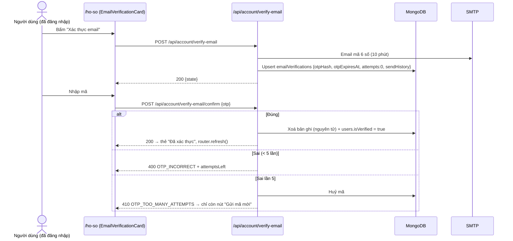
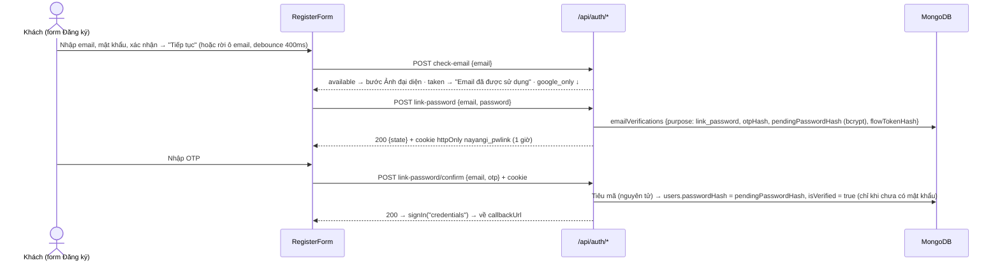

# Xác thực email (trang Hồ sơ) + thêm mật khẩu cho tài khoản Google

> Business rule: **BR-S15**, **BR-S16** trong [`BR_UC.md`](BR_UC.md). Liên quan: [`forgot-password.md`](forgot-password.md) — chỉ tài khoản đã xác thực email mới dùng được "Quên mật khẩu". Schema: [`database.md`](database.md) mục 1 (`users.isVerified`) và 18 (`emailVerifications`).

## 1. Tổng quan

- Đăng ký bằng email: đăng nhập và dùng mọi tính năng **ngay**, tài khoản ở trạng thái **chưa xác thực** (`isVerified=false`).
- Trang `/ho-so` hiện thẻ cảnh báo **"Email chưa được xác thực"** ở đầu cột nội dung + huy hiệu "Chưa xác thực" cạnh email (bấm để cuộn tới thẻ). Tài khoản đã xác thực: không có thẻ, huy hiệu "Đã xác thực".
- Bấm **"Xác thực email"** → gửi email HTML có mã 6 số → nhập mã ngay trong thẻ (6 ô, tự nhảy ô, dán cả mã, tự gửi khi đủ 6 số) → `isVerified=true`, thẻ chuyển sang "Đã xác thực email".
- Chưa xác thực → **không** dùng được Quên mật khẩu (báo "Không tìm thấy tài khoản hoặc tài khoản chưa xác thực email").
- Tài khoản Google: tạo mới với `isVerified=false`, `authProvider="google"` (`events.createUser` trong `lib/auth.ts`) → cũng thấy thẻ. Tài khoản Google tạo trước bản cập nhật 2026-09 giữ `isVerified=true` (đã chốt không migrate) → thấy thẻ "Tạo mật khẩu" (mục 6).



## 2. Kiến trúc

```
components/profile/EmailVerificationCard.tsx      (UI — tái dùng components/auth/OtpInput)
components/profile/CreatePasswordForm.tsx         (bước tạo mật khẩu sau khi xác thực)
components/auth/LinkGoogleAccountStep.tsx         (bước "Email đã liên kết Google" trong RegisterForm)
components/auth/OtpCodeForm.tsx                   (khối nhập OTP dùng chung với Quên mật khẩu)
features/email-verification/useEmailVerification.ts · useInitialPassword.ts
features/auth/usePasswordLinkFlow.ts
services/emailVerificationService.ts · accountLinkService.ts  (+ services/apiClient.ts)
app/api/account/verify-email/route.ts            (GET trạng thái, POST gửi mã)
app/api/account/verify-email/confirm/route.ts    (POST xác nhận)
app/api/account/set-password/route.ts            (POST tạo mật khẩu đầu tiên)
app/api/auth/check-email/route.ts                (POST — khách)
app/api/auth/link-password/route.ts · resend/ · confirm/   (POST — khách)
lib/emailVerificationHttp.ts   (kết quả → HTTP, yêu cầu đăng nhập, rate limit theo tài khoản)
lib/emailVerification.ts       (NGHIỆP VỤ cho cả 3 luồng, 1 logic OTP — test bằng repo giả: lib/emailVerification.test.ts)
lib/emailVerificationStore.ts  (nối MongoDB/SMTP/Log)
constants/emailVerification.ts (tham số)
```

## 3. API (cần đăng nhập — proxy chặn 401 nếu chưa; POST phải cùng Origin)

| Endpoint | Kết quả |
|---|---|
| `GET /api/account/verify-email` | `{ isVerified, hasPassword, maskedEmail, pending, serverTime }` — `pending` là mã đang còn hạn (để reload vẫn nhập tiếp) hoặc `null` |
| `POST /api/account/verify-email` | `200 { ok, state, serverTime }` · `409 ALREADY_VERIFIED` · `429 RESEND_COOLDOWN` (60s) / `RESEND_LIMIT` (5/giờ) / `RATE_LIMITED` · `503 EMAIL_FAILED` (không tính lượt) · `404 ACCOUNT_NOT_FOUND` |
| `POST /api/account/verify-email/confirm` `{ otp }` | `200 { ok }` · `400 INVALID_OTP_FORMAT` / `OTP_INCORRECT` (+`attemptsLeft`) · `410 OTP_EXPIRED` / `OTP_TOO_MANY_ATTEMPTS` / `OTP_INVALIDATED` · `409 ALREADY_VERIFIED` · `429 RATE_LIMITED` |

`state = { maskedEmail, otpExpiresAt, resendAvailableAt, sendsRemaining, attemptsLeft }` — giống luồng Quên mật khẩu, client bù lệch đồng hồ qua `serverTime`.

## 4. Tham số (`src/constants/emailVerification.ts`)

| Hằng số | Giá trị |
|---|---|
| `otpTtlMs` | 10 phút |
| `maxOtpAttempts` | 5 — đủ thì huỷ mã, **không** khoá tài khoản |
| `resendCooldownMs` / `maxSendsPerHour` | 60 giây / 5 mã mỗi giờ (cửa sổ trượt) |
| `recordRetentionMs` | 24 giờ (TTL bản ghi) |
| `EMAIL_VERIFICATION_USER_LIMITS` | gửi mã 10 request/giờ · xác nhận 30 request/15 phút — **theo tài khoản** (không theo IP) |

OTP 6 số dùng chung `PASSWORD_RESET_CONFIG.otpLength`. Hash: HMAC-SHA256 với `NEXTAUTH_SECRET`, scope `verify-email:<userId>`.

## 5. Tình huống

| Tình huống | Hành vi | Hiển thị |
|---|---|---|
| Chưa xác thực, mở Hồ sơ | Thẻ cảnh báo + nút "Xác thực email" | "Email chưa được xác thực…" |
| Reload khi đang chờ nhập mã | Server trả `pending` → thẻ mở sẵn ô nhập, đồng hồ chạy tiếp | — |
| Mã sai | Xoá ô, focus ô đầu | "Mã xác thực không đúng. Bạn còn N lần thử." |
| Sai lần 5 | Huỷ mã | "Bạn đã nhập sai quá nhiều lần nên mã đã bị huỷ. Vui lòng gửi mã mới." |
| Mã hết hạn / đã có mã mới hơn | Khoá ô nhập, chỉ còn nút gửi mã mới | "Mã xác thực đã hết hạn…" / "Mã này không còn hiệu lực…" |
| Bấm gửi lại trong 60s / quá 5 mã/giờ | Nút vô hiệu + đếm ngược | "Gửi lại sau mm:ss" |
| Xác thực ở tab khác rồi bấm ở tab này | `409 ALREADY_VERIFIED` → coi như thành công | Thẻ "Đã xác thực email" |
| SMTP lỗi / mất mạng | Không đổi trạng thái | Thông báo lỗi inline + toast |
| Chưa xác thực mà dùng Quên mật khẩu | Chặn ở bước 1 | "Không tìm thấy tài khoản hoặc tài khoản chưa xác thực email." + gợi ý đăng nhập để xác thực |

## 6. Tạo mật khẩu trong Hồ sơ (tài khoản Google)

- Hiện khi `isVerified && !passwordHash`: ngay sau khi nhập đúng OTP ở thẻ xác thực, hoặc mỗi lần mở Hồ sơ với tài khoản Google đã xác thực mà chưa có mật khẩu.
- Nhập mật khẩu + xác nhận (chính sách chung `lib/password.ts`, thanh độ mạnh như Quên mật khẩu). "Để sau" ẩn thẻ tới lần mở trang sau.
- `POST /api/account/set-password { password, confirmPassword }` (cần đăng nhập, rate limit theo tài khoản như bước xác nhận): `200` · `403 EMAIL_NOT_VERIFIED` · `409 ALREADY_HAS_PASSWORD` · `400 PASSWORD_MISMATCH / WEAK_PASSWORD`. Chỉ ghi khi tài khoản **chưa** có mật khẩu (điều kiện nguyên tử trong lệnh update). Thành công → notification `password_changed`.
- Phần "Bảo mật" dựa vào `hasPassword` (không dựa vào `authProvider`): có mật khẩu → form "Đổi mật khẩu"; chưa có → dẫn tới thẻ ở đầu trang.

## 7. Đăng ký bằng email của tài khoản chỉ có Google

"Chỉ có Google" = `users` không có `passwordHash` + có `accounts { provider: "google" }`.



| Endpoint | Kết quả |
|---|---|
| `POST /api/auth/check-email { email }` | `200 { status: "available" \| "taken" \| "google_only" }` · `400 INVALID_EMAIL` |
| `POST /api/auth/link-password { email, password }` | `200 { ok, state, serverTime }` + cookie · `400 WEAK_PASSWORD / INVALID_EMAIL` · `409 EMAIL_TAKEN / NO_GOOGLE_ACCOUNT` · `423 ACCOUNT_UNAVAILABLE` · `429 RESEND_COOLDOWN / RESEND_LIMIT / RATE_LIMITED` · `503 EMAIL_FAILED` |
| `POST /api/auth/link-password/resend { email }` | `200 { ok, state }` · `410 LINK_SESSION_INVALID` · `409 ALREADY_HAS_PASSWORD` · `429` · `503` |
| `POST /api/auth/link-password/confirm { email, otp }` | `200 { ok }` · lỗi mã như bảng mục 3 · `410 LINK_SESSION_INVALID` · `409 ALREADY_HAS_PASSWORD` · `423 ACCOUNT_UNAVAILABLE` |
| `POST /api/auth/register` (bước cuối) | Thêm `409 GOOGLE_ACCOUNT` (form chuyển sang luồng này) và `409 EMAIL_TAKEN` (kể cả khi 2 request trùng email chạy song song — unique index) |

Bảo mật:
- Mật khẩu **không** được gán trước khi OTP đúng; lúc chờ chỉ có hash bcrypt trong `pendingPasswordHash`, bản ghi tự xoá sau 1 giờ kể từ lần gửi mã cuối. Không lưu mật khẩu thô ở đâu cả (client chỉ giữ trong state của form để tự đăng nhập sau khi xong).
- OTP: hash HMAC (scope riêng `link-password:<userId>`), 10 phút, 5 lần sai thì huỷ, cooldown 60s + 5 mã/giờ (dùng chung `sendHistory` với luồng Hồ sơ), tiêu nguyên tử nên chỉ dùng 1 lần.
- Phiên gắn với trình duyệt đã bắt đầu (cookie httpOnly, `sameSite=strict`, path `/api/auth/link-password`; DB chỉ lưu hash). Người khác nhập email của bạn thì chỉ khiến bạn nhận 1 email — họ không có mã, còn bạn không thể vô tình xác nhận mật khẩu của họ vì phiên đó không nằm ở trình duyệt của bạn.
- Quay lại sửa mật khẩu khi mã còn hạn (cùng trình duyệt) → thay mật khẩu chờ gán, **không** gửi mã mới.
- Rate limit theo IP (`ACCOUNT_LINK_IP_LIMITS`): check-email 20/10 phút · start + resend 10/giờ · confirm 20/15 phút. Mọi API khách vẫn qua kiểm tra CSRF (Origin) ở proxy.
- `check-email` cho phép biết email đã có tài khoản hay chưa — chấp nhận để đáp ứng yêu cầu báo lỗi ngay ở bước 1 (API đăng ký vốn cũng trả "Email đã được sử dụng"); giảm thiểu bằng rate limit theo IP.

## 8. Dữ liệu cũ

- `authProvider` của tài khoản Google tạo trước bản cập nhật 2026-09: backfill bằng `npm run migrate:google-auth-provider` (mặc định dry-run, thêm `-- --apply` để ghi). Chỉ đặt `"google"` cho user có liên kết Google mà thiếu field hoặc đang `"local"` nhưng không có mật khẩu; không đụng `isVerified`/`passwordHash`.


Không cần migration dữ liệu: tài khoản local cũ có `isVerified=false` sẽ thấy thẻ cảnh báo và tự xác thực; trong lúc đó chưa dùng được Quên mật khẩu. Tạo index chủ động: `npm run migrate:password-reset -- --apply` (đã gồm `emailverifications`); dry-run của script cũng in số user có mật khẩu nhưng chưa xác thực.
