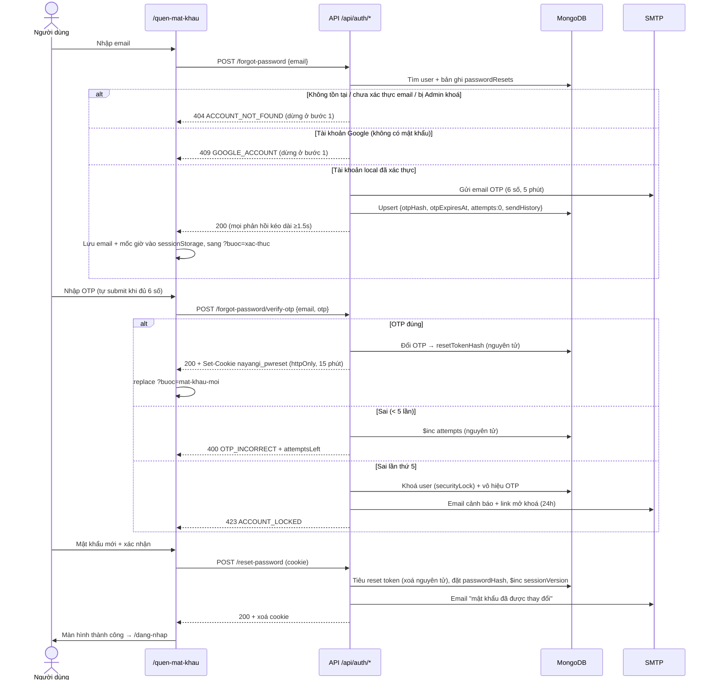
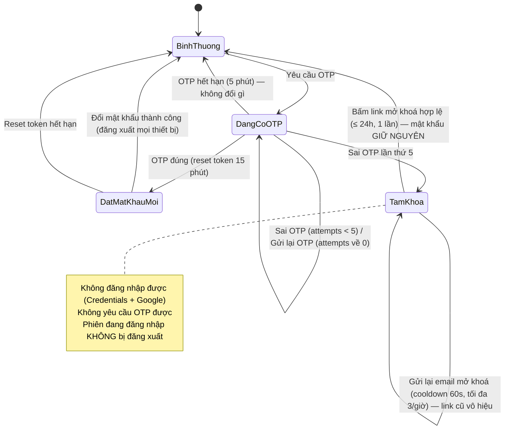

# Quên mật khẩu & Khoá / Mở khoá tài khoản

> Tài liệu nghiệp vụ + kỹ thuật cho luồng "Quên mật khẩu" (OTP qua email) và cơ chế tạm khoá tài khoản khi nhập sai OTP. Business rule tương ứng: **BR-S10 → BR-S15** trong [`BR_UC.md`](BR_UC.md) (mục 10). Schema: [`database.md`](database.md) mục 1 (`users.securityLock`, `users.isVerified`), 16 (`passwordResets`), 17 (`rateLimits`). **Chỉ tài khoản đã xác thực email mới dùng được luồng này** — xác thực email ở trang Hồ sơ, xem [`email-verification.md`](email-verification.md).

---

## 1. Tổng quan

| Trang | Route | Ghi chú |
|---|---|---|
| Quên mật khẩu (3 bước) | `/quen-mat-khau` (`?buoc=xac-thuc` · `?buoc=mat-khau-moi` · `?buoc=hoan-tat`) | Chỉ dành cho khách (BR-S09) — đã đăng nhập thì chuyển về trang chủ, đổi mật khẩu trong Hồ sơ |
| Mở khoá tài khoản | `/mo-khoa-tai-khoan?token=…` | Công khai; link nằm trong email cảnh báo |

Luồng: **Bước 1** nhập email → **Bước 2** nhập OTP 6 số → **Bước 3** đặt mật khẩu mới → **Hoàn tất** (tự về `/dang-nhap` sau 6 giây).

### Kiến trúc (theo CLAUDE.md mục 2)

```
components/auth/ForgotPassword*.tsx, OtpInput, PasswordStrengthMeter, UnlockAccountView, AuthCard, AuthStepIndicator   (UI)
features/password-reset/usePasswordResetFlow.ts   (state + điều hướng bước)
features/password-reset/passwordResetLogic.ts     (hàm thuần: mask email, cooldown, checklist mật khẩu…)
services/passwordResetService.ts                  (gọi API, bù lệch đồng hồ)
app/api/auth/{forgot-password,reset-password,unlock-account}/**/route.ts   (mỏng)
lib/passwordResetHttp.ts     (kết quả nghiệp vụ → HTTP, rate limit IP, cookie, cân bằng thời gian phản hồi)
lib/passwordReset.ts         (NGHIỆP VỤ — không import Mongoose/nodemailer, test bằng repo giả)
lib/passwordResetStore.ts    (nối MongoDB + SMTP + Log + Notification thật)
lib/rateLimit.ts, lib/email/{mailer,templates}.ts
constants/passwordReset.ts   (MỌI tham số cấu hình)
```

---

## 2. Sơ đồ

### 2.1 Sequence — Quên mật khẩu



### 2.2 State — Khoá / mở khoá tài khoản



---

## 3. API

Tất cả là JSON, cùng origin (proxy kiểm tra `Origin` = `Host` cho POST — thiếu/khác origin → `403`). Lỗi luôn có dạng `{ error: string (tiếng Việt), code: string, retryAfterMs?: number, attemptsLeft?: number }`; lỗi `429` kèm header `Retry-After` (giây). Lỗi bất ngờ → `500 SERVER_ERROR`.

### 3.1 `POST /api/auth/forgot-password` — gửi OTP

Request `{ "email": "trong@gmail.com" }` (không phân biệt hoa thường, tự trim).

| Status | code | Khi nào |
|---|---|---|
| 200 | — | `{ ok, resent, message, state, serverTime }` — đã gửi OTP. `resent:false` = đang trong cooldown nhưng mã cũ còn hạn → dùng tiếp mã cũ, không gửi mail mới |
| 400 | `INVALID_EMAIL` | Sai định dạng |
| 404 | `ACCOUNT_NOT_FOUND` | "Không tìm thấy tài khoản hoặc tài khoản chưa xác thực email." — email không tồn tại, **chưa xác thực email** (`isVerified=false`), hoặc bị Admin khoá (`banned`) |
| 409 | `GOOGLE_ACCOUNT` | Tài khoản chỉ đăng nhập Google (không có mật khẩu) |
| 423 | `ACCOUNT_LOCKED` | Tài khoản đang tạm khoá do sai OTP |
| 429 | `RESEND_LIMIT` | Đã gửi 5 lần trong 1 giờ cho email này |
| 429 | `RATE_LIMITED` | Vượt giới hạn theo IP (20/giờ) |
| 503 | `EMAIL_FAILED` | SMTP lỗi — không tính vào hạn mức, thử lại được ngay |

`state = { maskedEmail, otpExpiresAt, resendAvailableAt, sendsRemaining, attemptsLeft }` (epoch ms theo giờ server; client bù lệch bằng `serverTime`). Mọi phản hồi được kéo dài tối thiểu **1.5s (+0–200ms nhiễu)**.

### 3.2 `POST /api/auth/forgot-password/resend` — gửi lại OTP

Giống 3.1, khác duy nhất: đang trong cooldown 60s → `429 RESEND_COOLDOWN` (kèm `retryAfterMs`). Gửi thành công thì **OTP cũ vô hiệu ngay** và `attemptsLeft` về 5.

### 3.3 `POST /api/auth/forgot-password/verify-otp`

Request `{ "email": "...", "otp": "123456" }`. Rate limit IP: 30 / 15 phút.

| Status | code | Ghi chú |
|---|---|---|
| 200 | — | `{ ok, resetExpiresAt, serverTime }` + `Set-Cookie: nayangi_pwreset` (httpOnly, SameSite=Strict, Secure ở production, path `/api/auth`, hết hạn 15 phút) |
| 400 | `INVALID_OTP_FORMAT` | Không phải đúng 6 chữ số |
| 400 | `OTP_INCORRECT` | Kèm `attemptsLeft` |
| 410 | `OTP_EXPIRED` | Quá 5 phút |
| 410 | `OTP_INVALIDATED` | Chưa yêu cầu mã / mã đã dùng / đã bị thay bởi mã mới hơn |
| 423 | `ACCOUNT_LOCKED` | `justLocked: true` nếu vừa khoá ở lần sai này |

### 3.4 `GET /api/auth/reset-password` — trạng thái phiên bước 3

Đọc cookie → `{ active: true, maskedEmail, expiresAt, serverTime }` hoặc `{ active: false }` (và xoá cookie). Dùng khi reload/mở lại tab.

### 3.5 `POST /api/auth/reset-password` — đặt mật khẩu mới

Request `{ "password": "...", "confirmPassword": "..." }` + cookie. Rate limit IP: 20 / 15 phút.

| Status | code | Ghi chú |
|---|---|---|
| 200 | — | Đổi mật khẩu, `sessionVersion + 1`, xoá bản ghi reset, xoá cookie, gửi email xác nhận, tạo notification `password_changed` |
| 400 | `PASSWORD_MISMATCH` / `WEAK_PASSWORD` / `SAME_PASSWORD` | Token **không** bị tiêu — sửa lại rồi gửi tiếp được |
| 410 | `RESET_SESSION_EXPIRED` | Không có/hết hạn/đã dùng token → xoá cookie |

### 3.6 `POST /api/auth/unlock-account` — mở khoá

Request `{ "token": "<64 hex>" }`. Trang `/mo-khoa-tai-khoan` tự gọi khi mở (chỉ POST — trình quét link của hộp thư chỉ GET nên không "tiêu" mất token). Rate limit IP: 20/giờ.

| Status | code |
|---|---|
| 200 | Mở khoá, xoá bản ghi `passwordResets` (reset bộ đếm), gửi email "đã mở khoá". **Mật khẩu giữ nguyên** |
| 400 | `UNLOCK_INVALID` — sai định dạng / bị sửa / đã dùng / đã có link mới hơn / tài khoản không bị khoá |
| 410 | `UNLOCK_EXPIRED` — quá 24 giờ |

### 3.7 `POST /api/auth/unlock-account/resend` — gửi lại email mở khoá

Request `{ "email": "..." }` **hoặc** `{ "token": "<token cũ đã hết hạn>" }`. Rate limit IP: 10/giờ.

| Status | code |
|---|---|
| 200 | Thông báo chung "nếu tài khoản đang bị khoá, email đã được gửi" (email không bị khoá/không tồn tại cũng 200 nhưng không gửi gì). Link cũ vô hiệu |
| 400 | `UNLOCK_INVALID` (theo token không tìm thấy) |
| 429 | `RESEND_COOLDOWN` (60s) / `RESEND_LIMIT` (3/giờ/tài khoản) / `RATE_LIMITED` |
| 503 | `EMAIL_FAILED` |

### 3.8 Thay đổi ở API/luồng có sẵn

- `authorize()` (Credentials) ném `AccountLocked` khi `users.securityLock` tồn tại → form đăng nhập hiện "Tài khoản đang tạm khoá… kiểm tra email để mở khoá". `callbacks.signIn` chặn cả đăng nhập Google (`/dang-nhap?error=AccountLocked`).
- `proxy.ts`/`route-policy.ts`: các API auth tự viết (`register`, `forgot-password/**`, `reset-password`, `unlock-account/**`) không còn đi chung nhánh "NextAuth nội bộ" — vẫn public cho khách nhưng **phải qua kiểm tra CSRF Origin**.

---

## 4. Thay đổi DB (chỉ THÊM, không sửa/xoá field cũ)

| Thay đổi | Chi tiết |
|---|---|
| `users.securityLock` (optional) | `{ lockedAt, reason: "otp_failed", unlockTokenHash, unlockTokenExpiresAt, unlockEmailHistory[], lockIp, lockUserAgent }` — không có field = không bị khoá. Khác `accountStatus: "banned"` (Admin khoá). Index sparse `securityLock.unlockTokenHash` |
| Collection mới `passwordResets` | 1 bản ghi / email. Index unique `email`, TTL `expireAt` (24h sau lần cập nhật cuối), sparse `resetTokenHash` |
| Collection mới `rateLimits` | Bộ đếm cửa sổ cố định. Index unique `key`, TTL `expireAt` |
| `logs.action` (giá trị mới) | `password_reset_requested`, `password_reset_email_failed`, `password_reset_otp_failed`, `password_reset_otp_verified`, `account_locked`, `account_unlock_email_resent`, `account_unlocked`, `password_reset_completed` — **không bao giờ** ghi OTP/token thô; email trong metadata luôn ở dạng đã che |

**Migration:** không cần sửa dữ liệu cũ (field mới optional, collection mới tự tạo). Mongoose tự tạo index khi app kết nối; để tạo chủ động trên production:

```bash
npm run migrate:password-reset            # DRY-RUN: liệt kê index sẽ tạo
npm run migrate:password-reset -- --apply # tạo thật (idempotent)
```

---

## 5. Bảo mật

### 5.1 Lưu trữ bí mật
- OTP sinh bằng `crypto.randomInt` (6 số, có thể bắt đầu bằng 0). Reset/unlock token = `crypto.randomBytes(32)` hex.
- Chỉ lưu **HMAC-SHA256** với khoá `NEXTAUTH_SECRET` và "scope" riêng (`otp:<email>`, `reset`, `unlock`) — OTP chỉ có 10⁶ giá trị nên hash thường sẽ bị dò ngược offline nếu lộ DB; HMAC có khoá bí mật thì không. So sánh bằng `timingSafeEqual`.
- Reset token nằm trong cookie **httpOnly** (JS không đọc được) thay vì sessionStorage. sessionStorage chỉ giữ email + mốc thời gian.

### 5.2 Thông báo tài khoản & dò email (đã chốt — BR-S11)
- **Quyết định sản phẩm:** ưu tiên dễ hiểu cho người dùng — bước 1 báo lỗi rõ "Không tìm thấy tài khoản hoặc tài khoản chưa xác thực email" (gộp chung 3 trường hợp: không tồn tại / chưa xác thực / bị Admin khoá) và "tài khoản đăng nhập bằng Google". **Hệ quả chấp nhận:** người ngoài có thể dò được một email có phải tài khoản đã xác thực hay không. Giảm thiểu bằng rate limit theo IP (20/giờ) và thời gian phản hồi đều nhau.
- Chỉ email đủ điều kiện mới có bản ghi `passwordResets` (không còn "khoá giả" cho email lạ như bản đầu).
- Thời gian phản hồi bước gửi OTP được kéo dài tới ≥ 1.5s + nhiễu để che thời gian gửi SMTP.
- **Giới hạn đã biết:** trạng thái "đang bị khoá" (`423`) là thông tin cố ý lộ ra theo yêu cầu nghiệp vụ (hướng dẫn người dùng kiểm tra email); và khi SMTP lỗi (`503`) chỉ xảy ra với email có tài khoản.

### 5.3 Chống vét cạn & chạy song song
- Tối đa 5 lần sai / OTP; vượt → khoá. Đếm bằng `findOneAndUpdate` có điều kiện `attempts < 5` và `otpHash` hiện tại — gửi 100 request song song cũng chỉ được tính tối đa 5 lần đoán.
- Đổi OTP lấy reset token, tiêu reset token, mở khoá đều là **1 lệnh nguyên tử có điều kiện** → mỗi mã/token chỉ dùng được đúng 1 lần kể cả khi bấm đồng thời ở nhiều tab.
- Mỗi email chỉ có 1 bản ghi → OTP/reset token mới nhất luôn ghi đè cái cũ ("chỉ mới nhất hợp lệ").
- Rate limit theo IP (`rateLimits`, dùng được khi chạy nhiều instance). IP lấy từ `x-forwarded-for` (phần tử đầu) → `x-real-ip`; không có header (chạy local không qua proxy) thì mọi request chung bucket `unknown`.

### 5.4 Sau khi đổi mật khẩu
`sessionVersion + 1` → `callbacks.session()` (lib/auth.ts) coi mọi phiên cũ là `SessionRevoked` → thiết bị khác bị đăng xuất ở request kế tiếp (có toast giải thích qua `SessionErrorGuard`). Bản ghi `passwordResets` bị xoá (hết OTP/token còn sót).

---

## 6. Tham số cấu hình (`src/constants/passwordReset.ts`)

| Hằng số | Giá trị | Ý nghĩa |
|---|---|---|
| `otpLength` | 6 | Số chữ số OTP |
| `otpTtlMs` | 5 phút | Hạn OTP |
| `maxOtpAttempts` | 5 | Sai đủ số lần → tạm khoá. Về 0 khi gửi OTP mới |
| `resendCooldownMs` | 60 giây | Khoảng chờ giữa 2 lần gửi OTP |
| `maxOtpSendsPerHour` / `otpSendWindowMs` | 5 / 1 giờ | Tối đa lần gửi OTP (tính cả lần đầu) / email, cửa sổ trượt |
| `resetTokenTtlMs` | 15 phút | Hạn phiên bước 3 |
| `unlockTokenTtlMs` | 24 giờ | Hạn link mở khoá |
| `unlockEmailCooldownMs` / `maxUnlockEmailsPerHour` | 60 giây / 3 | Gửi lại email mở khoá (tính cả email cảnh báo đầu tiên) |
| `resetRecordRetentionMs` | 24 giờ | TTL bản ghi `passwordResets` |
| `minRequestResponseMs` | 1500 ms | Thời gian phản hồi tối thiểu bước gửi OTP |
| `successRedirectMs` | 6 giây | Tự chuyển về đăng nhập sau khi đổi thành công |
| `PASSWORD_RESET_IP_LIMITS` | requestOtp 20/giờ · verifyOtp 30/15 phút · resetPassword 20/15 phút · unlock 20/giờ · resendUnlock 10/giờ | Rate limit theo IP |

Chính sách mật khẩu dùng chung `src/lib/password.ts` (≥ 8 ký tự, có chữ, số, ký tự đặc biệt) — không tạo chính sách riêng. Hash bằng bcryptjs (10 rounds) như đăng ký/đổi mật khẩu.

---

## 7. Bảng tình huống

| # | Tình huống | Hành vi hệ thống | Thông báo hiển thị |
|---|---|---|---|
| 1a | Email sai định dạng | Chặn ở client (sau khi rời ô / bấm gửi); server cũng trả `400 INVALID_EMAIL` | "Email chưa đúng định dạng. Ví dụ: tenban@email.com" (inline) |
| 1b | Email không tồn tại | `404 ACCOUNT_NOT_FOUND`, không gửi gì, dừng ở bước 1 | "Không tìm thấy tài khoản hoặc tài khoản chưa xác thực email." + gợi ý đăng nhập để xác thực email trong Hồ sơ |
| 2a | Tài khoản đang tạm khoá | `423`, không tạo OTP | Màn "Tài khoản đang tạm khoá" + nút "Gửi lại email mở khoá" (cooldown) |
| 2b | Tài khoản bị Admin khoá (`banned`) | Xử lý như email không tồn tại — bị ban thì đổi mật khẩu cũng không đăng nhập được | Như 1b |
| 2c | Tài khoản Google (không có mật khẩu) | `409 GOOGLE_ACCOUNT`, không gửi gì, dừng ở bước 1 | "Tài khoản này đăng nhập bằng Google nên không có mật khẩu để đặt lại…" + link "Đến trang đăng nhập" |
| 2d | Tài khoản **chưa xác thực** email (`isVerified=false`) | Không cho đặt lại (BR-S15) — `404 ACCOUNT_NOT_FOUND` như 1b. Người dùng vẫn đăng nhập & dùng app bình thường, xác thực email trong trang Hồ sơ rồi mới dùng được Quên mật khẩu | Như 1b |
| 3a | OTP sai | `$inc attempts`, xoá trắng các ô, focus lại ô đầu | "Mã xác thực không đúng. Bạn còn N lần thử." + chip "Còn N lần thử" |
| 3b | OTP hết hạn | `410 OTP_EXPIRED`; client khoá ô nhập khi đồng hồ về 0 | "Mã đã hết hạn — hãy gửi lại mã mới" |
| 3c | OTP đã dùng / OTP cũ sau khi gửi lại | Mã đã dùng → `410 OTP_INVALIDATED`; mã cũ sau khi gửi lại → so với mã mới nên tính là **sai** (`OTP_INCORRECT`, trừ lượt) | "Mã này không còn hiệu lực…" / "Mã xác thực không đúng…" |
| 3d | Sai lần thứ 5 | Khoá tài khoản, vô hiệu OTP, gửi email cảnh báo (thời điểm, IP, thiết bị, nút mở khoá) | Màn "Tài khoản đang tạm khoá" |
| 4a | Bấm gửi lại trong cooldown | Nút bị vô hiệu + đếm ngược; gọi API vẫn `429 RESEND_COOLDOWN` | "Gửi lại sau 00:45" |
| 4b | Vượt 5 lần gửi/giờ | `429 RESEND_LIMIT`, nút chờ tới khi lần cũ nhất ra khỏi cửa sổ 1 giờ | "Bạn đã yêu cầu gửi mã quá nhiều lần. Vui lòng thử lại sau N phút." |
| 4c | Quay lại bước 1 và gửi lại đúng email trong cooldown | Không gửi mail mới, dùng tiếp mã cũ (`resent:false`) | Toast "Mã vừa được gửi trước đó vẫn còn hiệu lực — hãy kiểm tra hộp thư." |
| 5a | Ở bước 3, reload/đóng tab rồi quay lại trong 15 phút | Cookie httpOnly còn hạn → `GET /reset-password` active → vào lại bước 3 (cả khi mở `/quen-mat-khau` từ đầu) | Đồng hồ "Phiên đặt lại mật khẩu còn hiệu lực mm:ss" |
| 5b | Quay lại sau khi quá hạn | Về bước 1, xoá dữ liệu tạm | Toast "Phiên đặt lại mật khẩu đã hết hạn. Vui lòng bắt đầu lại." |
| 6 | Reload ở bước 2 | Email + mốc hết hạn/cooldown/lượt thử lấy lại từ sessionStorage | Đồng hồ chạy tiếp đúng thời gian còn lại |
| 7 | Vào thẳng `?buoc=xac-thuc` / `?buoc=mat-khau-moi` / `?buoc=hoan-tat` khi chưa đủ điều kiện | `router.replace` về bước 1 | (bước 3 hết hạn: toast như 5b) |
| 8 | Nhiều tab / request song song | 1 bản ghi / email, mọi thao tác "tiêu" là nguyên tử → chỉ OTP/token mới nhất dùng được, mỗi cái 1 lần | Tab cũ nhận "Mã này không còn hiệu lực…" |
| 9 | Nút Back của trình duyệt | 1→2 dùng `push` (Back về bước 1, email giữ nguyên); 2→3 và 3→hoàn tất dùng `replace` (Back từ bước 3/hoàn tất về bước 1, không quay lại OTP đã dùng); hiệu ứng trượt ngược chiều | — |
| 10 | Đang đăng nhập mà vào `/quen-mat-khau` | Redirect server-side về trang chủ (BR-S09, trang guest-only) | — (đổi mật khẩu trong Hồ sơ) |
| 11a | Mật khẩu mới trùng mật khẩu hiện tại | `400 SAME_PASSWORD`, token chưa bị tiêu | "Mật khẩu mới phải khác mật khẩu hiện tại." |
| 11b | Xác nhận không khớp | Báo realtime ở client, nút gửi bị khoá; server kiểm tra lại | "Mật khẩu xác nhận không khớp." |
| 11c | Quá yếu | Checklist tick realtime, nút gửi bị khoá; server kiểm tra lại | Checklist + thông điệp chính sách |
| 12a | Link mở khoá hết hạn | `410` | Màn "Liên kết mở khoá đã hết hạn" + nút "Gửi email mở khoá mới" |
| 12b | Link đã dùng / bị sửa / đã có link mới hơn / tài khoản không bị khoá | `400 UNLOCK_INVALID` | Màn "Không thể mở khoá bằng liên kết này" + nút Đăng nhập / Quên mật khẩu |
| 13 | SMTP lỗi | Không lưu OTP, không tính hạn mức, log `password_reset_email_failed` | "Không gửi được email lúc này. Vui lòng thử lại sau ít phút." (inline + toast) |
| 14 | Mất mạng / timeout 20s | Không đổi trạng thái, giữ nguyên dữ liệu đã nhập | "Không thể kết nối tới máy chủ…" / "Máy chủ phản hồi quá chậm…" (inline + toast) |
| 15 | Đổi mật khẩu khi thiết bị khác đang đăng nhập | `sessionVersion + 1` → thiết bị kia bị đăng xuất ở request kế tiếp | Thiết bị kia: toast "Phiên đăng nhập đã bị thu hồi…" |
| 16* | Đang khoá mà đăng nhập (mật khẩu hoặc Google) | Bị chặn | "Tài khoản đang tạm khoá do nhập sai mã xác thực quá nhiều lần. Vui lòng kiểm tra email để mở khoá." |
| 17* | Đang khoá mà đã có phiên đăng nhập ở thiết bị khác | Phiên đó **giữ nguyên** (đã chốt: khoá chỉ chặn đăng nhập mới — người đoán OTP chưa vào được tài khoản) | — |
| 18* | Mở link mở khoá khi email-scanner của hộp thư quét trước | Scanner chỉ GET trang, việc mở khoá cần POST từ JS → token không bị tiêu oan | — |
| 19* | Đồng hồ máy người dùng lệch giờ | Client bù lệch bằng `serverTime` → đếm ngược đúng | — |
| 20* | Dán mã / autofill "one-time-code" từ ứng dụng mail | Ô OTP nhận cả mã ở bất kỳ ô nào, tự điền 6 ô và tự gửi | — |

\* Tình huống phát sinh thêm ngoài danh sách yêu cầu.

---

## 8. Email

Template ở `src/lib/email/templates.ts` — bố cục theo `example/mail` nhưng **màu theo token CLAUDE.md 4.3** (email không đọc được CSS variable nên hex được ghi thẳng), table-based + inline CSS, có preheader và bản plain-text. Ảnh (linh vật) lấy qua URL tuyệt đối `NEXT_PUBLIC_SITE_URL` + `/brand/nayangi-mascot.png` — khi chạy local ảnh vẫn trỏ về domain công khai. Footer dùng `CONTACTS` trong `src/constants/brand.ts`.

| Email | Khi nào |
|---|---|
| Mã OTP đặt lại mật khẩu | Yêu cầu / gửi lại OTP (tài khoản local) |
| Cảnh báo: tài khoản đã tạm khoá | Sai OTP lần 5; gửi lại email mở khoá |
| Mật khẩu đã được thay đổi | Đặt lại thành công |
| Tài khoản đã được mở khoá | Mở khoá thành công |

---

## 9. Biến môi trường & test local

Xem `.env.example`. Mới thêm: `SMTP_HOST`, `SMTP_PORT`, `SMTP_SECURE`, `SMTP_USER`, `SMTP_PASS`, `MAIL_FROM`. Luồng này còn dùng `NEXTAUTH_SECRET` (khoá HMAC) và `NEXTAUTH_URL` (dựng link mở khoá).

**Test local không cần mail thật:** để trống `SMTP_HOST` → ở môi trường dev, mọi email (kèm OTP, link mở khoá) được **in ra console** của `npm run dev`. Ở production thiếu SMTP thì API trả `503 EMAIL_FAILED` (không âm thầm "gửi thành công").

**Test với hộp thư giả (xem được HTML):** chạy [Mailpit](https://mailpit.axllent.org/) (`mailpit` → SMTP `localhost:1025`, giao diện `http://localhost:8025`) rồi đặt `SMTP_HOST=localhost`, `SMTP_PORT=1025`, `SMTP_SECURE=false`.

**Gmail thật:** `SMTP_HOST=smtp.gmail.com`, `SMTP_PORT=465`, `SMTP_USER=<gmail>`, `SMTP_PASS=<App Password 16 ký tự>` (cần bật xác minh 2 bước), `MAIL_FROM="NayAnGi <gmail đó>"`.

**Test tự động:** `npm test` — `src/lib/passwordReset.test.ts` (luồng đầy đủ với repo giả trong bộ nhớ: gửi OTP, chặn tài khoản không tồn tại/chưa xác thực/bị khoá/Google, cooldown/giới hạn giờ, verify đúng/sai/hết hạn/mã cũ, khoá sau 5 lần, mở khoá, link hết hạn/dùng lại, đặt mật khẩu mới) + `src/features/password-reset/passwordResetLogic.test.ts` + `src/lib/route-policy.test.ts` (CSRF cho API mới).
